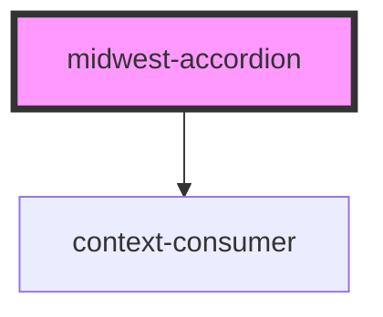

# midwest-accordion

<!-- Auto Generated Below -->

## Usage

### Default

<midwest-accordion>
	
Title <midwest-tag size='tiny'>New</midwest-tag>

	<h1>Content!</h1>
	<h2>Hello!</h2>
</midwest-accordion>

## Properties

| Property    | Attribute    | Description | Type      | Default          |
| ----------- | ------------ | ----------- | --------- | ---------------- |
| `compact`   | `compact`    |             | `boolean` | `undefined`      |
| `dark`      | `dark`       |             | `boolean` | `false`          |
| `label`     | `label`      |             | `string`  | `"More Details"` |
| `maxHeight` | `max-height` |             | `number`  | `50`             |
| `name`      | `name`       |             | `string`  | `"accordion"`    |
| `next`      | `next`       |             | `string`  | `undefined`      |
| `open`      | `open`       |             | `boolean` | `false`          |
| `tight`     | `tight`      |             | `boolean` | `undefined`      |
| `valid`     | `valid`      |             | `boolean` | `false`          |
| `validate`  | `validate`   |             | `boolean` | `undefined`      |

## Events

| Event    | Description | Type               |
| -------- | ----------- | ------------------ |
| `closed` |             | `CustomEvent<any>` |
| `opened` |             | `CustomEvent<any>` |

## Methods

### `openIfInvalid() => Promise<void>`

#### Returns

Type: `Promise<void>`

### `validateThis() => Promise<void>`

#### Returns

Type: `Promise<void>`

## Dependencies

### Depends on

- context-consumer

### Graph

----------------------------------------------

*Built with [StencilJS](https://stenciljs.com/)*
