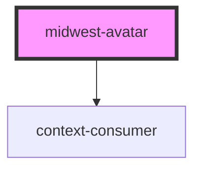

# stellar-avatar

<!-- Auto Generated Below -->

## Usage

### Colors

<stellar-avatar name="William M. Riley" color="red"></stellar-avatar>
<stellar-avatar name="William M. Riley" color="orange"></stellar-avatar>
<stellar-avatar name="William M. Riley" color="yellow"></stellar-avatar>
<stellar-avatar name="William M. Riley" color="lime"></stellar-avatar>
<stellar-avatar name="William M. Riley" color="green"></stellar-avatar>
<stellar-avatar name="William M. Riley" color="teal"></stellar-avatar>
<stellar-avatar name="William M. Riley" color="cyan"></stellar-avatar>
<stellar-avatar name="William M. Riley" color="blue"></stellar-avatar>
<stellar-avatar name="William M. Riley" color="indigo"></stellar-avatar>
<stellar-avatar name="William M. Riley" color="violet"></stellar-avatar>
<stellar-avatar name="William M. Riley" color="fuschia"></stellar-avatar>
<stellar-avatar name="William M. Riley" color="pink"></stellar-avatar>
<stellar-avatar name="William M. Riley" color="gray"></stellar-avatar>

### Default

<stellar-avatar name="William M. Riley"></stellar-avatar>

### Shape

<stellar-avatar name="William M. Riley" size="tiny" shape="circle"></stellar-avatar>
<stellar-avatar name="William M. Riley" size="small" shape="circle"></stellar-avatar>
<stellar-avatar name="William M. Riley" size="medium" shape="circle"></stellar-avatar>
<stellar-avatar name="William M. Riley" size="large" shape="circle"></stellar-avatar>

<stellar-avatar name="William M. Riley" size="tiny" shape="rectangle"></stellar-avatar>
<stellar-avatar name="William M. Riley" size="small" shape="rectangle"></stellar-avatar>
<stellar-avatar name="William M. Riley" size="medium" shape="rectangle"></stellar-avatar>
<stellar-avatar name="William M. Riley" size="large" shape="rectangle"></stellar-avatar>

<stellar-avatar name="William M. Riley" size="tiny" shape="diamond"></stellar-avatar>
<stellar-avatar name="William M. Riley" size="small" shape="diamond"></stellar-avatar>
<stellar-avatar name="William M. Riley" size="medium" shape="diamond"></stellar-avatar>
<stellar-avatar name="William M. Riley" size="large" shape="diamond"></stellar-avatar>

<stellar-avatar name="William M. Riley" size="tiny" shape="star"></stellar-avatar>
<stellar-avatar name="William M. Riley" size="small" shape="star"></stellar-avatar>
<stellar-avatar name="William M. Riley" size="medium" shape="star"></stellar-avatar>
<stellar-avatar name="William M. Riley" size="large" shape="star"></stellar-avatar>

<stellar-avatar name="William M. Riley" size="tiny" shape="message"></stellar-avatar>
<stellar-avatar name="William M. Riley" size="small" shape="message"></stellar-avatar>
<stellar-avatar name="William M. Riley" size="medium" shape="message"></stellar-avatar>
<stellar-avatar name="William M. Riley" size="large" shape="message"></stellar-avatar>

### Sizes

<stellar-avatar name="William M. Riley" size="tiny"></stellar-avatar>
<stellar-avatar name="William M. Riley" size="small"></stellar-avatar>
<stellar-avatar name="William M. Riley" size="medium"></stellar-avatar>
<stellar-avatar name="William M. Riley" size="large"></stellar-avatar>

## Properties

| Property     | Attribute    | Description | Type                                                                                   | Default            |
| ------------ | ------------ | ----------- | -------------------------------------------------------------------------------------- | ------------------ |
| `color`      | `color`      |             | `string`                                                                               | `"auto"`           |
| `dark`       | `dark`       |             | `boolean`                                                                              | `false`            |
| `icon`       | `icon`       |             | `string`                                                                               | `undefined`        |
| `initials`   | `initials`   |             | `string`                                                                               | `"MW"`             |
| `name`       | `name`       |             | `string`                                                                               | `"Midwest Design"` |
| `noTooltip`  | `no-tooltip` |             | `boolean`                                                                              | `false`            |
| `processing` | `processing` |             | `boolean`                                                                              | `false`            |
| `shape`      | `shape`      |             | `"circle" \| "diamond" \| "hexagon" \| "message" \| "rectangle" \| "square" \| "star"` | `"square"`         |
| `size`       | `size`       |             | `"huge" \| "large" \| "medium" \| "medium-small" \| "small" \| "tiny" \| "xlarge"`     | `undefined`        |
| `src`        | `src`        |             | `string`                                                                               | `undefined`        |

## Dependencies

### Depends on

- context-consumer

### Graph

----------------------------------------------

*Built with [StencilJS](https://stenciljs.com/)*
