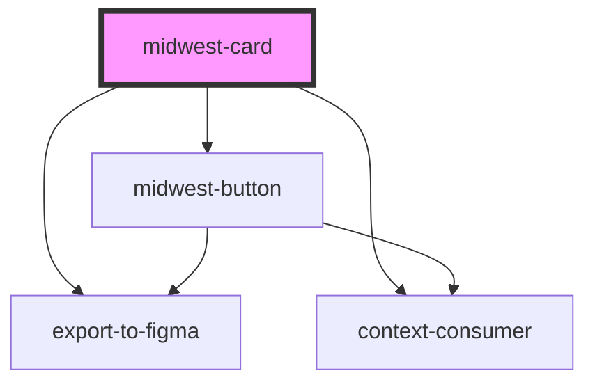

# midwest-card

<!-- Auto Generated Below -->

## Properties

| Property         | Attribute         | Description                                                                 | Type                                                 | Default     |
| ---------------- | ----------------- | --------------------------------------------------------------------------- | ---------------------------------------------------- | ----------- |
| `backHeight`     | `back-height`     |                                                                             | `number`                                             | `undefined` |
| `block`          | `block`           | Renders as a block in certain scenarios                                     | `boolean`                                            | `false`     |
| `compact`        | `compact`         | Sets the minimum height of the card to 0 when true.                         | `boolean`                                            | `false`     |
| `dark`           | `dark`            |                                                                             | `boolean`                                            | `false`     |
| `export`         | `export`          | disallows this component from exporting to figma                            | `boolean`                                            | `undefined` |
| `flipIcon`       | `flip-icon`       | Sets the href on the anchor tag if the button is a link.                    | `string`                                             | `"create"`  |
| `flipReady`      | `flip-ready`      | Let's a card be flippable                                                   | `boolean`                                            | `false`     |
| `flippable`      | `flippable`       | Let's a card be flippable                                                   | `boolean`                                            | `false`     |
| `flipped`        | `flipped`         | Renders a flipped card                                                      | `boolean`                                            | `false`     |
| `for`            | `for`             | Sets the href on the anchor tag if the button is a link.                    | `string`                                             | `undefined` |
| `horizontal`     | `horizontal`      | Renders the hard horizontally                                               | `boolean`                                            | `undefined` |
| `href`           | `href`            | Sets the href if the card is a link.                                        | `string`                                             | `"#"`       |
| `modalHref`      | `modal-href`      | Sets the href if the card is a link.                                        | `string`                                             | `undefined` |
| `name`           | `name`            | Sets the name if the card is a button.                                      | `string`                                             | `""`        |
| `originalHeight` | `original-height` |                                                                             | `number`                                             | `undefined` |
| `padding`        | `padding`         | Sets the padding inside of the button. Can be small, medium, or large.      | `"large" \| "medium" \| "none" \| "small" \| "tiny"` | `"medium"`  |
| `tag`            | `tag`             | Sets the element to render the card as - an anchor tag, a button, or a div. | `"a" \| "button" \| "div" \| "modal"`                | `"div"`     |
| `type`           | `type`            | Sets the type on a button                                                   | `string`                                             | `undefined` |
| `value`          | `value`           | Sets the value if the card is a button.                                     | `string`                                             | `"#"`       |

## Events

| Event         | Description | Type               |
| ------------- | ----------- | ------------------ |
| `close-modal` |             | `CustomEvent<any>` |
| `flip`        |             | `CustomEvent<any>` |
| `open-modal`  |             | `CustomEvent<any>` |

## Methods

### `flip_card() => Promise<void>`

#### Returns

Type: `Promise<void>`

## Dependencies

### Depends on

- [midwest-button](../button)
- export-to-figma
- context-consumer

### Graph

----------------------------------------------

*Built with [StencilJS](https://stenciljs.com/)*
