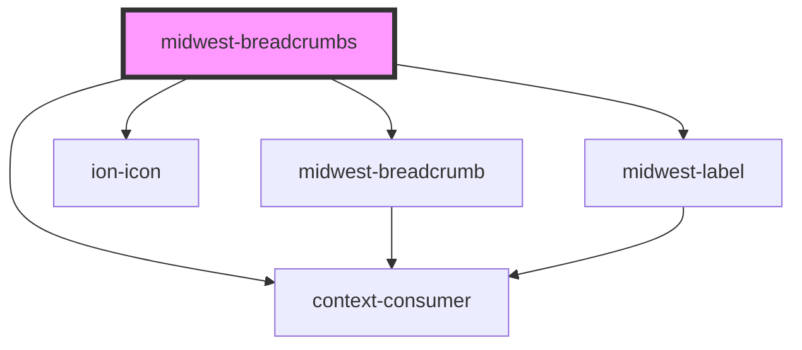

# midwest-breadcrumbs

<!-- Auto Generated Below -->

## Usage

### Default

<midwest-breadcrumbs icon="person">
	<midwest-breadcrumb>Profile</midwest-breadcrumb>
	<midwest-breadcrumb>Details</midwest-breadcrumb>
	<midwest-breadcrumb>Payment</midwest-breadcrumb>
	<midwest-breadcrumb>testing</midwest-breadcrumb>
	<midwest-breadcrumb>overflow</midwest-breadcrumb>
	<midwest-breadcrumb>so that</midwest-breadcrumb>
	<midwest-breadcrumb>We can see</midwest-breadcrumb>
	<midwest-breadcrumb>What exactly it looks like</midwest-breadcrumb>
	<midwest-breadcrumb>Right now</midwest-breadcrumb>
</midwest-breadcrumbs>

### Theming

<midwest-breadcrumbs icon="person" class="theme-violet">
	<midwest-breadcrumb>Profile</midwest-breadcrumb>
	<midwest-breadcrumb>Details</midwest-breadcrumb>
	<midwest-breadcrumb><ion-icon name="people"></ion-icon>Payment</midwest-breadcrumb>
</midwest-breadcrumbs>

## Properties

| Property      | Attribute     | Description | Type                                       | Default                                        |
| ------------- | ------------- | ----------- | ------------------------------------------ | ---------------------------------------------- |
| `color`       | `color`       |             | `string`                                   | `"blue5"`                                      |
| `dark`        | `dark`        |             | `boolean`                                  | `false`                                        |
| `description` | `description` |             | `string`                                   | `"An icon that shows the main page you're on"` |
| `home`        | `home`        |             | `string`                                   | `"/"`                                          |
| `icon`        | `icon`        |             | `string`                                   | `'analytics'`                                  |
| `icon_size`   | `icon_size`   |             | `number`                                   | `0.85`                                         |
| `icon_src`    | `icon_src`    |             | `string`                                   | `undefined`                                    |
| `label`       | `label`       |             | `string`                                   | `"Home"`                                       |
| `size`        | `size`        |             | `"large" \| "medium" \| "small" \| "tiny"` | `undefined`                                    |
| `tag`         | `tag`         |             | `"link" \| "route"`                        | `"link"`                                       |

## Dependencies

### Depends on

- [midwest-breadcrumb](../breadcrumb)
- ion-icon
- [midwest-label](../label)
- context-consumer

### Graph

----------------------------------------------

*Built with [StencilJS](https://stenciljs.com/)*
