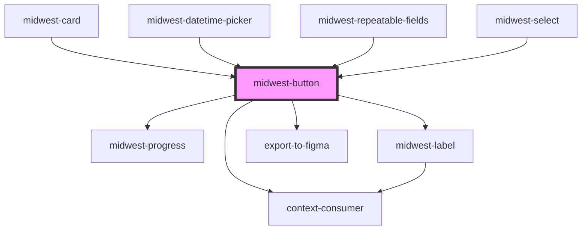

# midwest-button

<!-- Auto Generated Below -->

## Properties

| Property            | Attribute            | Description                                                                                           | Type                                                                  | Default     |
| ------------------- | -------------------- | ----------------------------------------------------------------------------------------------------- | --------------------------------------------------------------------- | ----------- |
| `active`            | `active`             | Sets the button or link as an active state.                                                           | `boolean`                                                             | `false`     |
| `authenticityToken` | `authenticity-token` | Authenticty Token                                                                                     | `string`                                                              | `undefined` |
| `block`             | `block`              | Sets the button or link to render at full width to the parent.                                        | `boolean`                                                             | `false`     |
| `buttonTabIndex`    | `button-tab-index`   |                                                                                                       | `number`                                                              | `0`         |
| `confirm`           | `confirm`            |                                                                                                       | `string`                                                              | `undefined` |
| `contrast`          | `contrast`           | Sets the button or link as an outlined button.                                                        | `boolean`                                                             | `false`     |
| `dark`              | `dark`               | Sets the button or link as an outlined button.                                                        | `boolean`                                                             | `false`     |
| `disabled`          | `disabled`           | Sets the button or link as disabled and not-interactable.                                             | `boolean`                                                             | `false`     |
| `export`            | `export`             | Makes sure the button cannot be exported.                                                             | `boolean`                                                             | `undefined` |
| `for`               | `for`                | Sets the href on the anchor tag if the button is a link.                                              | `string`                                                              | `undefined` |
| `ghost`             | `ghost`              |                                                                                                       | `boolean`                                                             | `false`     |
| `href`              | `href`               | Sets the href on the anchor tag if the button is a link.                                              | `string`                                                              | `'#'`       |
| `icon`              | `icon`               | Sets the button or link as a button with only an icon.                                                | `boolean`                                                             | `false`     |
| `iconOnly`          | `icon-only`          | Sets the button or link as a button with only an icon.                                                | `boolean`                                                             | `false`     |
| `invert`            | `invert`             | Sets the button or link as an outlined button.                                                        | `boolean`                                                             | `false`     |
| `label`             | `label`              | Sets accessibility options on the buttons                                                             | `string`                                                              | `'Submit'`  |
| `method`            | `method`             | Sets the button or link as an active state.                                                           | `"delete" \| "get" \| "patch" \| "post" \| "put"`                     | `undefined` |
| `modalHref`         | `modal-href`         | Sets the href on the anchor tag if the button is a link.                                              | `string`                                                              | `undefined` |
| `name`              | `name`               | Sets the name on the button if the button is an input. Allows the button to act as an item in a form. | `string`                                                              | `undefined` |
| `outline`           | `outline`            | Sets the button or link as an outlined button.                                                        | `boolean`                                                             | `false`     |
| `padding`           | `padding`            | Sets the padding inside of the button.                                                                | `"large" \| "small" \| "tiny"`                                        | `undefined` |
| `pill`              | `pill`               | Sets the button or link to render as a pill.                                                          | `boolean`                                                             | `false`     |
| `pjaxSelector`      | `pjax-selector`      |                                                                                                       | `string`                                                              | `undefined` |
| `processable`       | `processable`        | Sets the button or link as processing when clicked.                                                   | `boolean`                                                             | `false`     |
| `processing`        | `processing`         |                                                                                                       | `boolean`                                                             | `false`     |
| `size`              | `size`               | Sets the size of the button.                                                                          | `"large" \| "small" \| "tiny"`                                        | `undefined` |
| `stopPropagation`   | `stop-propagation`   | Sets the button or link as an active state.                                                           | `boolean`                                                             | `undefined` |
| `tag`               | `tag`                | Allows the button to render for different tags.                                                       | `"button" \| "link" \| "modal" \| "onboarding" \| "span" \| "submit"` | `"link"`    |
| `target`            | `target`             | Sets the target on the anchor tag if the button is a link.                                            | `string`                                                              | `'_self'`   |
| `usePjax`           | `use-pjax`           |                                                                                                       | `boolean`                                                             | `true`      |
| `value`             | `value`              | Sets the value on the button if the button is an input.                                               | `string`                                                              | `undefined` |

## Events

| Event              | Description | Type               |
| ------------------ | ----------- | ------------------ |
| `close-modal`      |             | `CustomEvent<any>` |
| `close-onboarding` |             | `CustomEvent<any>` |
| `delete-entry`     |             | `CustomEvent<any>` |
| `open-modal`       |             | `CustomEvent<any>` |
| `open-onboarding`  |             | `CustomEvent<any>` |

## Dependencies

### Used by

 - [midwest-card](../card)
 - [midwest-datetime-picker](../../forms/datetime-picker)
 - [midwest-repeatable-fields](../../forms/repeatable-fields)
 - [midwest-select](../../forms/select)

### Depends on

- [midwest-progress](../progress)
- [midwest-label](../label)
- export-to-figma
- context-consumer

### Graph

----------------------------------------------

*Built with [StencilJS](https://stenciljs.com/)*
