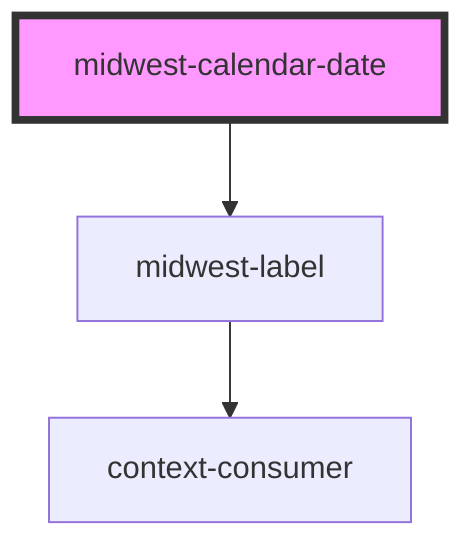

# midwest-calendar-date

<!-- Auto Generated Below -->

## Properties

| Property | Attribute | Description | Type      | Default     |
| -------- | --------- | ----------- | --------- | ----------- |
| `clock`  | `clock`   |             | `boolean` | `undefined` |
| `dark`   | `dark`    |             | `boolean` | `undefined` |
| `end`    | `end`     |             | `string`  | `undefined` |
| `start`  | `start`   |             | `string`  | `undefined` |
| `time`   | `time`    |             | `boolean` | `undefined` |

## Dependencies

### Depends on

- [midwest-label](../label)

### Graph

----------------------------------------------

*Built with [StencilJS](https://stenciljs.com/)*
