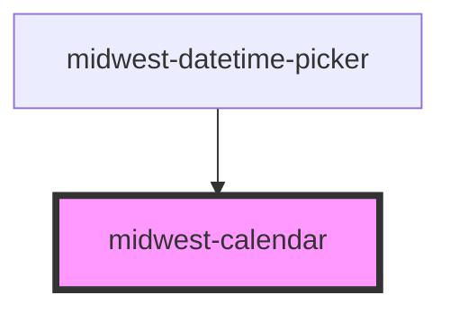

# midwest-calendar

<!-- Auto Generated Below -->

## Properties

| Property           | Attribute      | Description | Type                  | Default     |
| ------------------ | -------------- | ----------- | --------------------- | ----------- |
| `backgroundEvents` | --             |             | `any[]`               | `undefined` |
| `dark`             | `dark`         |             | `boolean`             | `false`     |
| `events`           | --             |             | `any[]`               | `undefined` |
| `header`           | `header`       |             | `boolean \| object`   | `false`     |
| `noToolbar`        | `no-toolbar`   |             | `boolean`             | `undefined` |
| `selectRange`      | `select-range` |             | `boolean`             | `undefined` |
| `selectable`       | `selectable`   |             | `boolean`             | `undefined` |
| `size`             | `size`         |             | `"medium" \| "small"` | `"medium"`  |
| `value`            | `value`        |             | `Date \| string`      | `undefined` |

## Events

| Event       | Description | Type               |
| ----------- | ----------- | ------------------ |
| `dateClick` |             | `CustomEvent<any>` |

## Methods

### `addEvent(event: EventDef) => Promise<void>`

#### Returns

Type: `Promise<void>`

### `getCalendar() => Promise<Calendar>`

#### Returns

Type: `Promise<Calendar>`

### `select(date: Date) => Promise<void>`

#### Returns

Type: `Promise<void>`

## Dependencies

### Used by

 - [midwest-datetime-picker](../../forms/datetime-picker)

### Graph

----------------------------------------------

*Built with [StencilJS](https://stenciljs.com/)*
