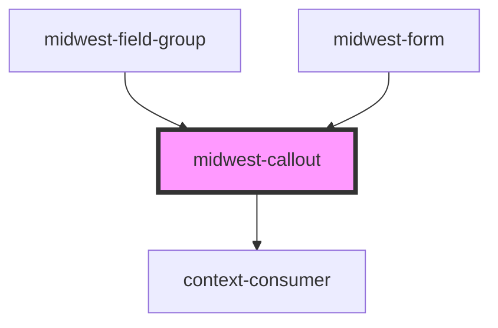

# midwest-callout

<!-- Auto Generated Below -->

## Properties

| Property | Attribute | Description | Type                                                     | Default     |
| -------- | --------- | ----------- | -------------------------------------------------------- | ----------- |
| `dark`   | `dark`    |             | `boolean`                                                | `false`     |
| `type`   | `type`    |             | `"alert" \| "default" \| "error" \| "info" \| "success"` | `"default"` |

## Dependencies

### Used by

 - [midwest-field-group](../../forms/field-group)
 - [midwest-form](../../forms/form)

### Depends on

- context-consumer

### Graph

----------------------------------------------

*Built with [StencilJS](https://stenciljs.com/)*
