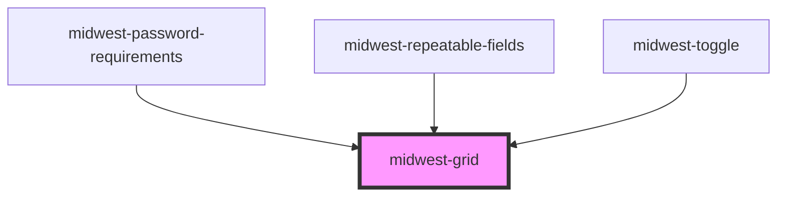

# midwest-grid

<!-- Auto Generated Below -->

## Properties

| Property       | Attribute      | Description | Type               | Default  |
| -------------- | -------------- | ----------- | ------------------ | -------- |
| `cols`         | `cols`         |             | `number \| string` | `"auto"` |
| `columnGap`    | `column-gap`   |             | `number`           | `2`      |
| `columnWidth`  | `column-width` |             | `number`           | `200`    |
| `noresponsive` | `noresponsive` |             | `boolean`          | `false`  |
| `padding`      | `padding`      |             | `boolean`          | `false`  |

## Methods

### `refresh() => Promise<void>`

#### Returns

Type: `Promise<void>`

## Dependencies

### Used by

 - [midwest-password-requirements](../../forms/password-requirements)
 - [midwest-repeatable-fields](../../forms/repeatable-fields)
 - [midwest-toggle](../../forms/toggle)

### Graph

----------------------------------------------

*Built with [StencilJS](https://stenciljs.com/)*
