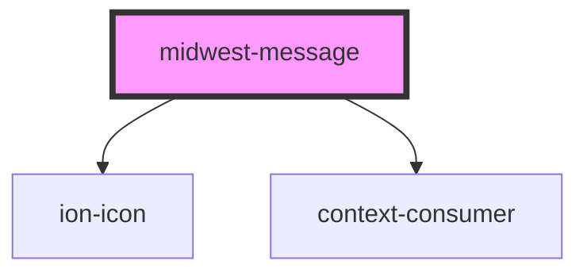

# midwest-message

<!-- Auto Generated Below -->

## Properties

| Property   | Attribute   | Description | Type                                        | Default            |
| ---------- | ----------- | ----------- | ------------------------------------------- | ------------------ |
| `autoHide` | `auto-hide` |             | `boolean`                                   | `undefined`        |
| `closable` | `closable`  |             | `boolean`                                   | `true`             |
| `closing`  | `closing`   |             | `boolean`                                   | `undefined`        |
| `dark`     | `dark`      |             | `boolean`                                   | `false`            |
| `height`   | `height`    |             | `boolean \| number`                         | `60`               |
| `name`     | `name`      |             | `string`                                    | `"midwest-design"` |
| `opening`  | `opening`   |             | `boolean`                                   | `undefined`        |
| `remember` | `remember`  |             | `boolean`                                   | `undefined`        |
| `shown`    | `shown`     |             | `boolean`                                   | `undefined`        |
| `size`     | `size`      |             | `"default" \| "full"`                       | `undefined`        |
| `striped`  | `striped`   |             | `boolean`                                   | `false`            |
| `type`     | `type`      |             | `"alert" \| "error" \| "info" \| "success"` | `undefined`        |

## Dependencies

### Depends on

- ion-icon
- context-consumer

### Graph

----------------------------------------------

*Built with [StencilJS](https://stenciljs.com/)*
