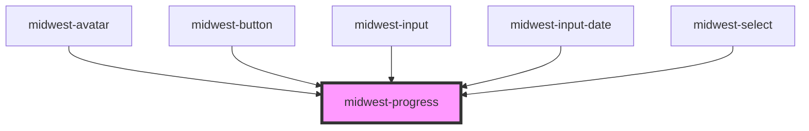

# midwest-progress

<!-- Auto Generated Below -->

## Usage

### Default

<midwest-progress value="1" max="20" id="awesome" slender></midwest-progress>
<midwest-button onClick="document.querySelector('#awesome').value = 3">3</midwest-button>
<midwest-button onClick="document.querySelector('#awesome').value = 9">9</midwest-button>
<midwest-button onClick="document.querySelector('#awesome').value = 18">18</midwest-button>
<midwest-button onClick="document.querySelector('#awesome').slender = !document.querySelector('#awesome').slender">Toggle slender</midwest-button>

## Properties

| Property        | Attribute       | Description                                                                                             | Type      | Default |
| --------------- | --------------- | ------------------------------------------------------------------------------------------------------- | --------- | ------- |
| `dark`          | `dark`          | Sets the button or link as an outlined button.                                                          | `boolean` | `false` |
| `editable`      | `editable`      | Allows the progress bar to be clicked on, to help the user to navigate through the progressing content. | `boolean` | `false` |
| `indeterminate` | `indeterminate` | Sets the maximum cap for steps in the progress bar                                                      | `boolean` | `false` |
| `max`           | `max`           | Sets the maximum cap for steps in the progress bar                                                      | `number`  | `100`   |
| `noease`        | `noease`        | eliminates the easing in the css so you can apply value updates without jitter.                         | `boolean` | `false` |
| `rounded`       | `rounded`       | eliminates the easing in the css so you can apply value updates without jitter.                         | `boolean` | `false` |
| `secondary`     | `secondary`     | Sets the value of the progress bar                                                                      | `number`  | `0`     |
| `slender`       | `slender`       | Renders if this element is slender or not                                                               | `boolean` | `false` |
| `value`         | `value`         | Sets the value of the progress bar                                                                      | `number`  | `0`     |

## Events

| Event    | Description | Type               |
| -------- | ----------- | ------------------ |
| `update` |             | `CustomEvent<any>` |

## Dependencies

### Used by

 - [midwest-avatar](../avatar)
 - [midwest-button](../button)
 - [midwest-input](../../forms/input)
 - [midwest-input-date](../../forms/input-date)
 - [midwest-select](../../forms/select)

### Graph

----------------------------------------------

*Built with [StencilJS](https://stenciljs.com/)*
