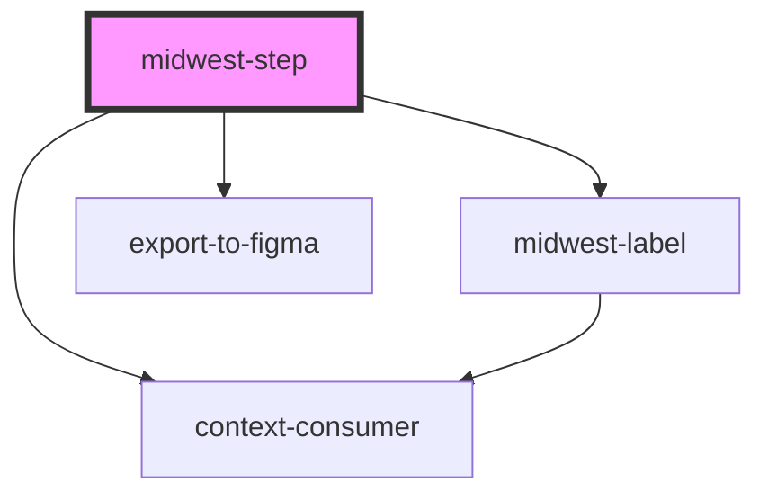

# midwest-step

<!-- Auto Generated Below -->

## Properties

| Property   | Attribute   | Description | Type                                                                                                                                                  | Default     |
| ---------- | ----------- | ----------- | ----------------------------------------------------------------------------------------------------------------------------------------------------- | ----------- |
| `base`     | `base`      |             | `"blue" \| "cyan" \| "gold" \| "gray" \| "green" \| "indigo" \| "lime" \| "magenta" \| "orange" \| "pink" \| "red" \| "teal" \| "violet" \| "yellow"` | `undefined` |
| `complete` | `complete`  |             | `boolean`                                                                                                                                             | `false`     |
| `current`  | `current`   |             | `boolean`                                                                                                                                             | `false`     |
| `dark`     | `dark`      |             | `boolean`                                                                                                                                             | `undefined` |
| `disabled` | `disabled`  |             | `boolean`                                                                                                                                             | `false`     |
| `error`    | `error`     |             | `boolean`                                                                                                                                             | `false`     |
| `export`   | `export`    |             | `boolean`                                                                                                                                             | `false`     |
| `href`     | `href`      |             | `string`                                                                                                                                              | `"#"`       |
| `open`     | `open`      |             | `boolean`                                                                                                                                             | `false`     |
| `order`    | `order`     |             | `number`                                                                                                                                              | `undefined` |
| `past`     | `past`      |             | `boolean`                                                                                                                                             | `false`     |
| `tabCount` | `tab-count` |             | `number`                                                                                                                                              | `undefined` |
| `validate` | `validate`  |             | `boolean`                                                                                                                                             | `undefined` |

## Events

| Event           | Description | Type               |
| --------------- | ----------- | ------------------ |
| `contentChange` |             | `CustomEvent<any>` |
| `updated`       |             | `CustomEvent<any>` |

## Methods

### `activate() => Promise<void>`

#### Returns

Type: `Promise<void>`

### `isValid() => Promise<boolean>`

#### Returns

Type: `Promise<boolean>`

### `show_validation() => Promise<void>`

#### Returns

Type: `Promise<void>`

## Dependencies

### Depends on

- [midwest-label](../label)
- export-to-figma
- context-consumer

### Graph

----------------------------------------------

*Built with [StencilJS](https://stenciljs.com/)*
