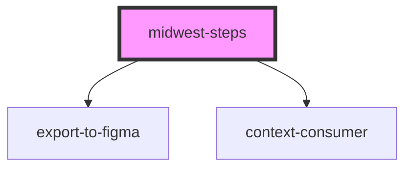

# midwest-steps

<!-- Auto Generated Below -->

## Properties

| Property   | Attribute  | Description | Type      | Default     |
| ---------- | ---------- | ----------- | --------- | ----------- |
| `dark`     | `dark`     |             | `boolean` | `false`     |
| `name`     | `name`     |             | `string`  | `undefined` |
| `validate` | `validate` |             | `boolean` | `undefined` |

## Methods

### `contents() => Promise<HTMLMidwestContentElement[]>`

#### Returns

Type: `Promise<HTMLMidwestContentElement[]>`

### `steps() => Promise<HTMLMidwestStepElement[]>`

#### Returns

Type: `Promise<HTMLMidwestStepElement[]>`

### `switch(step: HTMLMidwestStepElement) => Promise<void>`

#### Returns

Type: `Promise<void>`

## Dependencies

### Depends on

- export-to-figma
- context-consumer

### Graph

----------------------------------------------

*Built with [StencilJS](https://stenciljs.com/)*
