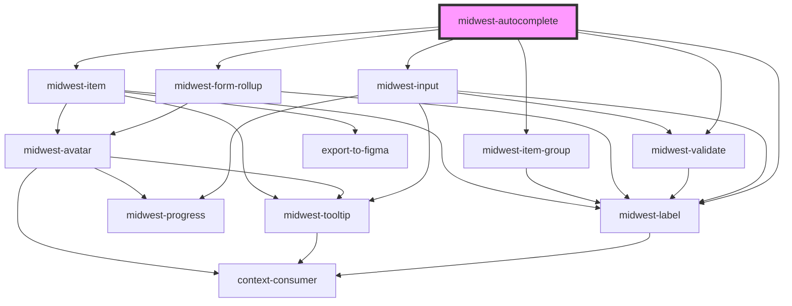

# midwest-autocomplete

<!-- Auto Generated Below -->

## Properties

| Property        | Attribute         | Description | Type                                       | Default                  |
| --------------- | ----------------- | ----------- | ------------------------------------------ | ------------------------ |
| `dark`          | `dark`            |             | `boolean`                                  | `undefined`              |
| `dummy`         | `dummy`           |             | `boolean`                                  | `undefined`              |
| `freeTextField` | `free-text-field` |             | `string`                                   | `undefined`              |
| `groups`        | --                |             | `string[]`                                 | `[]`                     |
| `inline`        | `inline`          |             | `boolean`                                  | `undefined`              |
| `label`         | `label`           |             | `string`                                   | `"Choose a user"`        |
| `name`          | `name`            |             | `string`                                   | `undefined`              |
| `noAvatars`     | `no-avatars`      |             | `boolean`                                  | `undefined`              |
| `open`          | `open`            |             | `boolean`                                  | `undefined`              |
| `options`       | --                |             | `Item[]`                                   | `[]`                     |
| `placeholder`   | `placeholder`     |             | `string`                                   | `"Search for a User..."` |
| `position`      | `position`        |             | `"down" \| "up"`                           | `"down"`                 |
| `ready`         | `ready`           |             | `boolean`                                  | `undefined`              |
| `required`      | `required`        |             | `boolean`                                  | `undefined`              |
| `results`       | `results`         |             | `number`                                   | `12`                     |
| `selected`      | --                |             | `Item[]`                                   | `[]`                     |
| `tag`           | `tag`             |             | `"a" \| "button" \| "checkbox" \| "radio"` | `"radio"`                |
| `url`           | `url`             |             | `string`                                   | `undefined`              |
| `valid`         | `valid`           |             | `boolean`                                  | `undefined`              |
| `value`         | `value`           |             | `string \| string[]`                       | `undefined`              |
| `verbiage`      | `verbiage`        |             | `string`                                   | `"User"`                 |

## Events

| Event              | Description | Type               |
| ------------------ | ----------- | ------------------ |
| `custom`           |             | `CustomEvent<any>` |
| `predefined`       |             | `CustomEvent<any>` |
| `selectionChanged` |             | `CustomEvent<any>` |

## Methods

### `optionEls() => Promise<HTMLMidwestItemElement[]>`

#### Returns

Type: `Promise<HTMLMidwestItemElement[]>`

### `validate(set?: boolean) => Promise<FormResult>`

#### Returns

Type: `Promise<FormResult>`

## Dependencies

### Depends on

- [midwest-label](../../common/label)
- [midwest-input](../input)
- [midwest-form-rollup](../form-rollup)
- [midwest-item-group](../item-group)
- [midwest-item](../item)
- [midwest-validate](../validate)

### Graph

----------------------------------------------

*Built with [StencilJS](https://stenciljs.com/)*
