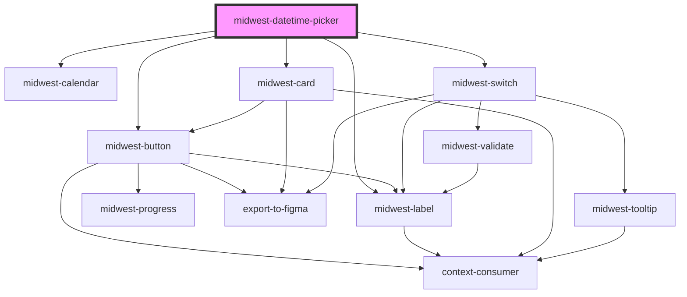

# midwest-datetime-picker

<!-- Auto Generated Below -->

## Properties

| Property      | Attribute      | Description                        | Type                                                    | Default      |
| ------------- | -------------- | ---------------------------------- | ------------------------------------------------------- | ------------ |
| `autoClose`   | `auto-close`   | auto close when minute is selected | `boolean`                                               | `true`       |
| `dark`        | `dark`         |                                    | `boolean`                                               | `false`      |
| `dialRadius`  | `dial-radius`  |                                    | `number`                                                | `135`        |
| `duration`    | `duration`     |                                    | `number`                                                | `350`        |
| `innerRadius` | `inner-radius` |                                    | `number`                                                | `70`         |
| `method`      | `method`       |                                    | `"date" \| "datetime" \| "time"`                        | `'datetime'` |
| `outerRadius` | `outer-radius` |                                    | `number`                                                | `105`        |
| `showClear`   | `show-clear`   |                                    | `boolean`                                               | `false`      |
| `tickRadius`  | `tick-radius`  |                                    | `number`                                                | `20`         |
| `value`       | `value`        |                                    | `string \| string[]`                                    | `'now'`      |
| `view`        | `view`         |                                    | `"days" \| "hours" \| "minutes" \| "months" \| "years"` | `"hours"`    |

## Events

| Event          | Description | Type               |
| -------------- | ----------- | ------------------ |
| `blurred`      |             | `CustomEvent<any>` |
| `cancel`       |             | `CustomEvent<any>` |
| `close-modal`  |             | `CustomEvent<any>` |
| `micro-update` |             | `CustomEvent<any>` |
| `update`       |             | `CustomEvent<any>` |

## Methods

### `decrement() => Promise<void>`

#### Returns

Type: `Promise<void>`

### `increment() => Promise<void>`

#### Returns

Type: `Promise<void>`

### `updateHand(value?: number | string) => Promise<void>`

#### Returns

Type: `Promise<void>`

## Dependencies

### Depends on

- [midwest-calendar](../../common/calendar)
- [midwest-button](../../common/button)
- [midwest-card](../../common/card)
- [midwest-switch](../switch)
- [midwest-label](../../common/label)

### Graph

----------------------------------------------

*Built with [StencilJS](https://stenciljs.com/)*
