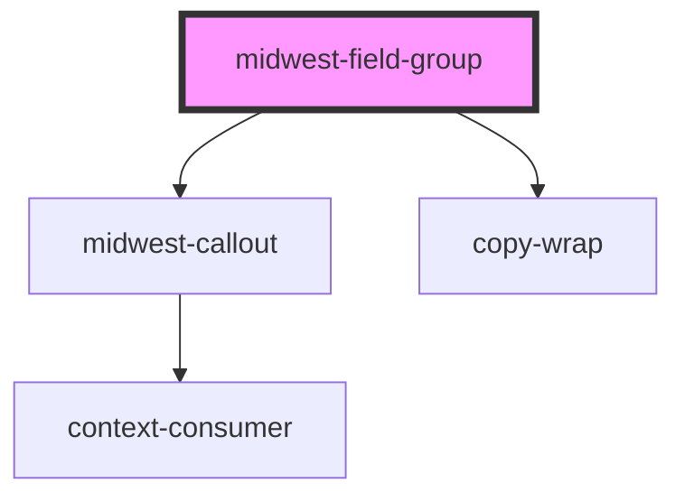

# midwest-field-group

<!-- Auto Generated Below -->

## Events

| Event          | Description | Type               |
| -------------- | ----------- | ------------------ |
| `fast-updates` |             | `CustomEvent<any>` |
| `submitted`    |             | `CustomEvent<any>` |
| `updated`      |             | `CustomEvent<any>` |

## Methods

### `addElement(el: HTMLElement) => Promise<void>`

#### Returns

Type: `Promise<void>`

### `removeElement(el: HTMLElement) => Promise<void>`

#### Returns

Type: `Promise<void>`

### `state(validate?: boolean) => Promise<{ els: any; json: any; results: FormResult[]; namedResults: { [name: string]: string; }; formData: any; valid: boolean; }>`

#### Returns

Type: `Promise<{ els: any; json: any; results: FormResult[]; namedResults: { [name: string]: string; }; formData: any; valid: boolean; }>`

### `submitForm() => Promise<void>`

#### Returns

Type: `Promise<void>`

## Dependencies

### Depends on

- [midwest-callout](../../common/callout)
- [copy-wrap](../../common/copy-wrap)

### Graph

----------------------------------------------

*Built with [StencilJS](https://stenciljs.com/)*
