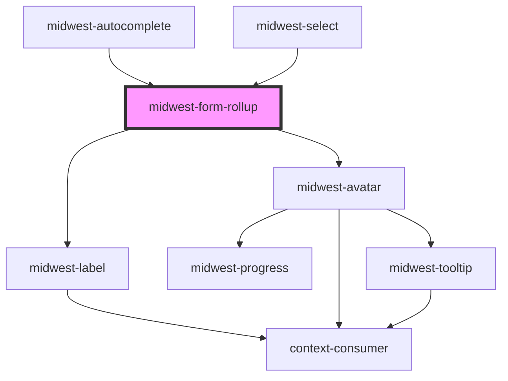

# midwest-form-rollup

<!-- Auto Generated Below -->

## Properties

| Property      | Attribute     | Description | Type                       | Default              |
| ------------- | ------------- | ----------- | -------------------------- | -------------------- |
| `appendCopy`  | `append-copy` |             | `string`                   | `undefined`          |
| `count`       | `count`       |             | `number`                   | `3`                  |
| `fallback`    | `fallback`    |             | `string`                   | `"Choose something"` |
| `for`         | `for`         |             | `string`                   | `undefined`          |
| `noAvatars`   | `no-avatars`  |             | `boolean`                  | `undefined`          |
| `options`     | --            |             | `HTMLMidwestItemElement[]` | `undefined`          |
| `placeholder` | `placeholder` |             | `string`                   | `undefined`          |
| `show`        | `show`        |             | `boolean`                  | `true`               |
| `verbiage`    | `verbiage`    |             | `string`                   | `"item"`             |

## Methods

### `update() => Promise<void>`

#### Returns

Type: `Promise<void>`

## Dependencies

### Used by

 - [midwest-autocomplete](../autocomplete)
 - [midwest-select](../select)

### Depends on

- [midwest-label](../../common/label)
- [midwest-avatar](../../common/avatar)

### Graph

----------------------------------------------

*Built with [StencilJS](https://stenciljs.com/)*
