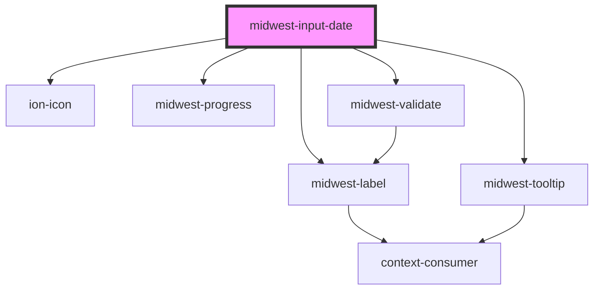

# midwest-input-date

<!-- Auto Generated Below -->

## Properties

| Property            | Attribute          | Description                                              | Type                                                          | Default                   |
| ------------------- | ------------------ | -------------------------------------------------------- | ------------------------------------------------------------- | ------------------------- |
| `autofocus`         | `autofocus`        |                                                          | `boolean`                                                     | `false`                   |
| `customValidations` | --                 |                                                          | `CustomFunction`                                              | `undefined`               |
| `dark`              | `dark`             | Sets the button to dark.                                 | `boolean`                                                     | `false`                   |
| `dateFocus`         | `date-focus`       |                                                          | `"ampm" \| "date" \| "hour" \| "minute" \| "month" \| "year"` | `undefined`               |
| `dateRangeFocus`    | `date-range-focus` |                                                          | `"from" \| "to"`                                              | `undefined`               |
| `description`       | `description`      |                                                          | `string`                                                      | `undefined`               |
| `disabled`          | `disabled`         |                                                          | `boolean`                                                     | `undefined`               |
| `focused`           | `focused`          |                                                          | `boolean`                                                     | `false`                   |
| `from`              | `from`             |                                                          | `string`                                                      | `undefined`               |
| `inline`            | `inline`           | Sets the display to inline                               | `boolean`                                                     | `false`                   |
| `inputTabIndex`     | `input-tab-index`  |                                                          | `number`                                                      | `0`                       |
| `label`             | `label`            |                                                          | `string`                                                      | `undefined`               |
| `leftIcon`          | `left-icon`        | Sets the button to dark.                                 | `string`                                                      | `undefined`               |
| `max`               | `max`              |                                                          | `number`                                                      | `undefined`               |
| `min`               | `min`              |                                                          | `number`                                                      | `undefined`               |
| `name`              | `name`             | The name of the input element                            | `string`                                                      | `undefined`               |
| `noDuration`        | `no-duration`      |                                                          | `boolean`                                                     | `undefined`               |
| `novalidate`        | `novalidate`       |                                                          | `boolean`                                                     | `false`                   |
| `placeholder`       | `placeholder`      |                                                          | `string`                                                      | `"Enter a date and time"` |
| `processing`        | `processing`       |                                                          | `boolean`                                                     | `false`                   |
| `range`             | `range`            | The kind of element that the Input should be rendered as | `"date" \| "datetime" \| "time"`                              | `undefined`               |
| `readonly`          | `readonly`         |                                                          | `boolean`                                                     | `false`                   |
| `required`          | `required`         |                                                          | `boolean`                                                     | `false`                   |
| `shift`             | `shift`            |                                                          | `boolean`                                                     | `false`                   |
| `size`              | `size`             |                                                          | `"default" \| "large" \| "small"`                             | `"default"`               |
| `step`              | `step`             |                                                          | `number`                                                      | `1`                       |
| `to`                | `to`               |                                                          | `string`                                                      | `undefined`               |
| `tooltip`           | `tooltip`          |                                                          | `string`                                                      | `undefined`               |
| `type`              | `type`             | The kind of element that the Input should be rendered as | `"date" \| "datetime" \| "time"`                              | `"datetime"`              |
| `valid`             | `valid`            |                                                          | `boolean`                                                     | `undefined`               |
| `value`             | `value`            | The pre-set value to pass to the input element           | `string`                                                      | `undefined`               |

## Events

| Event      | Description           | Type               |
| ---------- | --------------------- | ------------------ |
| `blurring` | Public: Blur event    | `CustomEvent<any>` |
| `focusing` | Public: Focus event   | `CustomEvent<any>` |
| `update`   | Public: Updated event | `CustomEvent<any>` |

## Methods

### `getDateTimeFromModal() => Promise<void>`

#### Returns

Type: `Promise<void>`

### `resetValue() => Promise<void>`

#### Returns

Type: `Promise<void>`

### `setFocus() => Promise<void>`

#### Returns

Type: `Promise<void>`

### `stepDown() => Promise<void>`

#### Returns

Type: `Promise<void>`

### `stepUp() => Promise<void>`

#### Returns

Type: `Promise<void>`

### `validate(set?: boolean) => Promise<FormResult>`

#### Returns

Type: `Promise<FormResult>`

## Dependencies

### Depends on

- [midwest-label](../../common/label)
- ion-icon
- [midwest-progress](../../common/progress)
- [midwest-tooltip](../../common/tooltip)
- [midwest-validate](../validate)

### Graph

----------------------------------------------

*Built with [StencilJS](https://stenciljs.com/)*
