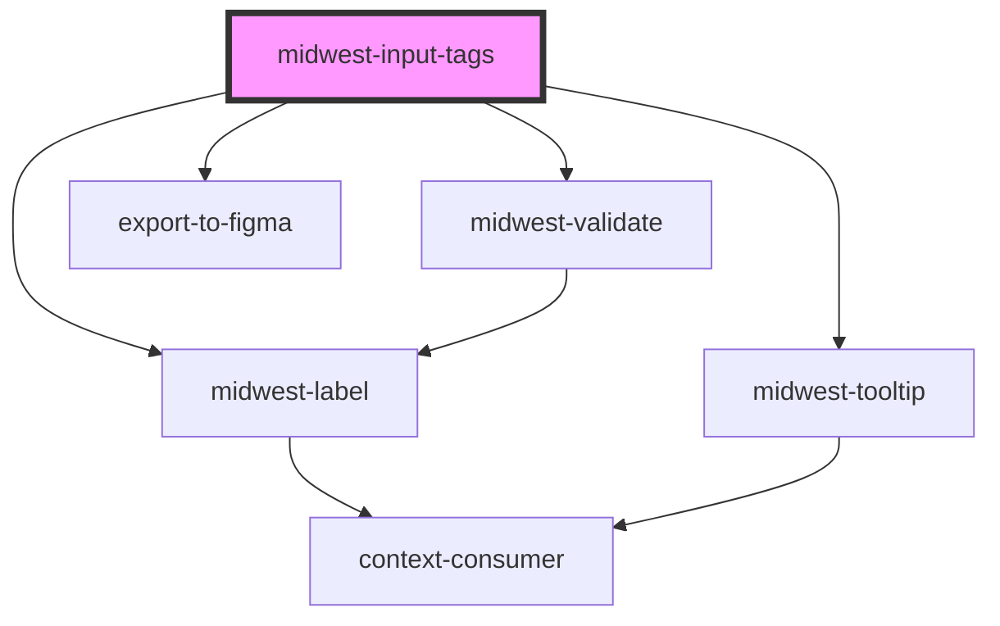

# midwest-input-tags

<!-- Auto Generated Below -->

## Properties

| Property            | Attribute         | Description | Type                                                                                                                                                  | Default           |
| ------------------- | ----------------- | ----------- | ----------------------------------------------------------------------------------------------------------------------------------------------------- | ----------------- |
| `allowNewItems`     | `allow-new-items` |             | `boolean`                                                                                                                                             | `false`           |
| `autofocus`         | `autofocus`       |             | `boolean`                                                                                                                                             | `false`           |
| `base`              | `base`            |             | `"blue" \| "cyan" \| "gold" \| "gray" \| "green" \| "indigo" \| "lime" \| "magenta" \| "orange" \| "pink" \| "red" \| "teal" \| "violet" \| "yellow"` | `undefined`       |
| `complement`        | `complement`      |             | `"blue" \| "cyan" \| "gold" \| "gray" \| "green" \| "indigo" \| "lime" \| "magenta" \| "orange" \| "pink" \| "red" \| "teal" \| "violet" \| "yellow"` | `undefined`       |
| `customValidations` | --                |             | `CustomFunction`                                                                                                                                      | `undefined`       |
| `dark`              | `dark`            |             | `boolean`                                                                                                                                             | `false`           |
| `description`       | `description`     |             | `string`                                                                                                                                              | `undefined`       |
| `disabled`          | `disabled`        |             | `boolean`                                                                                                                                             | `undefined`       |
| `export`            | `export`          |             | `boolean`                                                                                                                                             | `undefined`       |
| `focused`           | `focused`         |             | `boolean`                                                                                                                                             | `false`           |
| `inputTabIndex`     | `input-tab-index` |             | `number`                                                                                                                                              | `0`               |
| `items`             | --                |             | `{ id: number; name: string; }[]`                                                                                                                     | `[]`              |
| `label`             | `label`           |             | `string`                                                                                                                                              | `undefined`       |
| `minChars`          | `min-chars`       |             | `number`                                                                                                                                              | `undefined`       |
| `name`              | `name`            |             | `string`                                                                                                                                              | `undefined`       |
| `novalidate`        | `novalidate`      |             | `boolean`                                                                                                                                             | `false`           |
| `placeholder`       | `placeholder`     |             | `string`                                                                                                                                              | `"Enter a value"` |
| `readonly`          | `readonly`        |             | `boolean`                                                                                                                                             | `false`           |
| `required`          | `required`        |             | `boolean`                                                                                                                                             | `false`           |
| `size`              | `size`            |             | `"default" \| "large" \| "small"`                                                                                                                     | `"default"`       |
| `tooltip`           | `tooltip`         |             | `string`                                                                                                                                              | `undefined`       |
| `valid`             | `valid`           |             | `boolean`                                                                                                                                             | `undefined`       |
| `value`             | `value`           |             | `any`                                                                                                                                                 | `undefined`       |

## Events

| Event      | Description | Type               |
| ---------- | ----------- | ------------------ |
| `bluring`  |             | `CustomEvent<any>` |
| `focusing` |             | `CustomEvent<any>` |
| `update`   |             | `CustomEvent<any>` |

## Methods

### `validate(set?: boolean) => Promise<FormResult>`

#### Returns

Type: `Promise<FormResult>`

## Dependencies

### Depends on

- [midwest-label](../../common/label)
- [midwest-tooltip](../../common/tooltip)
- [midwest-validate](../validate)
- export-to-figma

### Graph

----------------------------------------------

*Built with [StencilJS](https://stenciljs.com/)*
