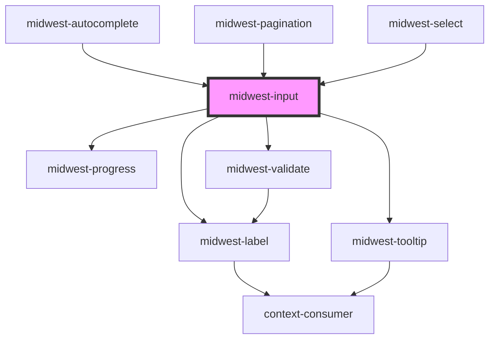

# midwest-input

<!-- Auto Generated Below -->

## Properties

| Property               | Attribute               | Description                                              | Type                                                                                                                                                                                                                                                                                                                                                                                                                                                                                                                                                                                                                                                                                                                                                                            | Default           |
| ---------------------- | ----------------------- | -------------------------------------------------------- | ------------------------------------------------------------------------------------------------------------------------------------------------------------------------------------------------------------------------------------------------------------------------------------------------------------------------------------------------------------------------------------------------------------------------------------------------------------------------------------------------------------------------------------------------------------------------------------------------------------------------------------------------------------------------------------------------------------------------------------------------------------------------------- | ----------------- |
| `autocomplete`         | `autocomplete`          |                                                          | `"postal-code" \| "url" \| "name" \| "honorific-prefix" \| "given-name" \| "additional-name" \| "family-name" \| "honorific-suffix" \| "nickname" \| "username" \| "current-password" \| "new-password" \| "one-time-code" \| "organization-title" \| "organization" \| "street-address" \| "address-line1" \| "address-line2" \| "address-line3" \| "address-level4" \| "address-level3" \| "address-level2" \| "address-level1" \| "country" \| "country-name" \| "cc-name" \| "cc-given-name" \| "cc-additional-name" \| "cc-family-name" \| "cc-number" \| "cc-exp" \| "cc-exp-month" \| "cc-exp-year" \| "cc-csc" \| "cc-type" \| "transaction-currency" \| "transaction-amount" \| "language" \| "bday" \| "bday-day" \| "bday-month" \| "bday-year" \| "sex" \| "photo"` | `undefined`       |
| `autofocus`            | `autofocus`             |                                                          | `boolean`                                                                                                                                                                                                                                                                                                                                                                                                                                                                                                                                                                                                                                                                                                                                                                       | `false`           |
| `autoformat`           | `autoformat`            |                                                          | `boolean`                                                                                                                                                                                                                                                                                                                                                                                                                                                                                                                                                                                                                                                                                                                                                                       | `undefined`       |
| `capsLock`             | `caps-lock`             |                                                          | `boolean`                                                                                                                                                                                                                                                                                                                                                                                                                                                                                                                                                                                                                                                                                                                                                                       | `false`           |
| `cols`                 | `cols`                  |                                                          | `number`                                                                                                                                                                                                                                                                                                                                                                                                                                                                                                                                                                                                                                                                                                                                                                        | `30`              |
| `customValidations`    | --                      |                                                          | `CustomFunction`                                                                                                                                                                                                                                                                                                                                                                                                                                                                                                                                                                                                                                                                                                                                                                | `undefined`       |
| `dark`                 | `dark`                  | Sets the button to dark.                                 | `boolean`                                                                                                                                                                                                                                                                                                                                                                                                                                                                                                                                                                                                                                                                                                                                                                       | `false`           |
| `default`              | `default`               | The pre-set value to pass to the input element           | `readonly string[] \| string`                                                                                                                                                                                                                                                                                                                                                                                                                                                                                                                                                                                                                                                                                                                                                   | `undefined`       |
| `description`          | `description`           |                                                          | `string`                                                                                                                                                                                                                                                                                                                                                                                                                                                                                                                                                                                                                                                                                                                                                                        | `undefined`       |
| `descriptionTransform` | `description-transform` |                                                          | `"capitalize" \| "full-size-kana" \| "full-width" \| "lowercase" \| "none" \| "uppercase"`                                                                                                                                                                                                                                                                                                                                                                                                                                                                                                                                                                                                                                                                                      | `"uppercase"`     |
| `disabled`             | `disabled`              |                                                          | `boolean`                                                                                                                                                                                                                                                                                                                                                                                                                                                                                                                                                                                                                                                                                                                                                                       | `undefined`       |
| `focused`              | `focused`               |                                                          | `boolean`                                                                                                                                                                                                                                                                                                                                                                                                                                                                                                                                                                                                                                                                                                                                                                       | `false`           |
| `formatter`            | `formatter`             |                                                          | `string`                                                                                                                                                                                                                                                                                                                                                                                                                                                                                                                                                                                                                                                                                                                                                                        | `undefined`       |
| `icon`                 | `icon`                  |                                                          | `boolean`                                                                                                                                                                                                                                                                                                                                                                                                                                                                                                                                                                                                                                                                                                                                                                       | `false`           |
| `increments`           | `increments`            | The name of the input element                            | `boolean`                                                                                                                                                                                                                                                                                                                                                                                                                                                                                                                                                                                                                                                                                                                                                                       | `true`            |
| `inline`               | `inline`                | Sets the display to inline                               | `boolean`                                                                                                                                                                                                                                                                                                                                                                                                                                                                                                                                                                                                                                                                                                                                                                       | `false`           |
| `inputTabIndex`        | `input-tab-index`       |                                                          | `number`                                                                                                                                                                                                                                                                                                                                                                                                                                                                                                                                                                                                                                                                                                                                                                        | `0`               |
| `label`                | `label`                 |                                                          | `string`                                                                                                                                                                                                                                                                                                                                                                                                                                                                                                                                                                                                                                                                                                                                                                        | `undefined`       |
| `leftIcon`             | `left-icon`             | Sets the button to dark.                                 | `string`                                                                                                                                                                                                                                                                                                                                                                                                                                                                                                                                                                                                                                                                                                                                                                        | `undefined`       |
| `match`                | `match`                 |                                                          | `string`                                                                                                                                                                                                                                                                                                                                                                                                                                                                                                                                                                                                                                                                                                                                                                        | `undefined`       |
| `max`                  | `max`                   |                                                          | `number`                                                                                                                                                                                                                                                                                                                                                                                                                                                                                                                                                                                                                                                                                                                                                                        | `undefined`       |
| `maxlength`            | `maxlength`             |                                                          | `number`                                                                                                                                                                                                                                                                                                                                                                                                                                                                                                                                                                                                                                                                                                                                                                        | `1000`            |
| `min`                  | `min`                   |                                                          | `number`                                                                                                                                                                                                                                                                                                                                                                                                                                                                                                                                                                                                                                                                                                                                                                        | `undefined`       |
| `minChars`             | `min-chars`             |                                                          | `number`                                                                                                                                                                                                                                                                                                                                                                                                                                                                                                                                                                                                                                                                                                                                                                        | `2`               |
| `name`                 | `name`                  | The name of the input element                            | `string`                                                                                                                                                                                                                                                                                                                                                                                                                                                                                                                                                                                                                                                                                                                                                                        | `undefined`       |
| `novalidate`           | `novalidate`            |                                                          | `boolean`                                                                                                                                                                                                                                                                                                                                                                                                                                                                                                                                                                                                                                                                                                                                                                       | `false`           |
| `placeholder`          | `placeholder`           |                                                          | `string`                                                                                                                                                                                                                                                                                                                                                                                                                                                                                                                                                                                                                                                                                                                                                                        | `"Enter a value"` |
| `processing`           | `processing`            |                                                          | `boolean`                                                                                                                                                                                                                                                                                                                                                                                                                                                                                                                                                                                                                                                                                                                                                                       | `false`           |
| `readonly`             | `readonly`              |                                                          | `boolean`                                                                                                                                                                                                                                                                                                                                                                                                                                                                                                                                                                                                                                                                                                                                                                       | `false`           |
| `required`             | `required`              |                                                          | `boolean`                                                                                                                                                                                                                                                                                                                                                                                                                                                                                                                                                                                                                                                                                                                                                                       | `false`           |
| `requirements`         | `requirements`          | The pre-set value to pass to the input element           | `boolean`                                                                                                                                                                                                                                                                                                                                                                                                                                                                                                                                                                                                                                                                                                                                                                       | `false`           |
| `rows`                 | `rows`                  |                                                          | `number`                                                                                                                                                                                                                                                                                                                                                                                                                                                                                                                                                                                                                                                                                                                                                                        | `2`               |
| `shift`                | `shift`                 |                                                          | `boolean`                                                                                                                                                                                                                                                                                                                                                                                                                                                                                                                                                                                                                                                                                                                                                                       | `false`           |
| `showCapsLock`         | `show-caps-lock`        |                                                          | `boolean`                                                                                                                                                                                                                                                                                                                                                                                                                                                                                                                                                                                                                                                                                                                                                                       | `false`           |
| `size`                 | `size`                  |                                                          | `"default" \| "large" \| "small"`                                                                                                                                                                                                                                                                                                                                                                                                                                                                                                                                                                                                                                                                                                                                               | `"default"`       |
| `spellcheck`           | `spellcheck`            |                                                          | `boolean`                                                                                                                                                                                                                                                                                                                                                                                                                                                                                                                                                                                                                                                                                                                                                                       | `true`            |
| `step`                 | `step`                  |                                                          | `number`                                                                                                                                                                                                                                                                                                                                                                                                                                                                                                                                                                                                                                                                                                                                                                        | `1`               |
| `tooltip`              | `tooltip`               |                                                          | `string`                                                                                                                                                                                                                                                                                                                                                                                                                                                                                                                                                                                                                                                                                                                                                                        | `undefined`       |
| `type`                 | `type`                  | The kind of element that the Input should be rendered as | `"currency" \| "email" \| "hidden" \| "number" \| "password" \| "postal-code" \| "search" \| "tel" \| "text" \| "textarea" \| "url"`                                                                                                                                                                                                                                                                                                                                                                                                                                                                                                                                                                                                                                            | `"text"`          |
| `valid`                | `valid`                 |                                                          | `boolean`                                                                                                                                                                                                                                                                                                                                                                                                                                                                                                                                                                                                                                                                                                                                                                       | `undefined`       |
| `value`                | `value`                 | The pre-set value to pass to the input element           | `readonly string[] \| string`                                                                                                                                                                                                                                                                                                                                                                                                                                                                                                                                                                                                                                                                                                                                                   | `undefined`       |
| `wrap`                 | `wrap`                  |                                                          | `string`                                                                                                                                                                                                                                                                                                                                                                                                                                                                                                                                                                                                                                                                                                                                                                        | `"soft"`          |

## Events

| Event      | Description           | Type               |
| ---------- | --------------------- | ------------------ |
| `blurring` | Public: Blur event    | `CustomEvent<any>` |
| `focusing` | Public: Focus event   | `CustomEvent<any>` |
| `update`   | Public: Updated event | `CustomEvent<any>` |

## Methods

### `resetValue() => Promise<void>`

#### Returns

Type: `Promise<void>`

### `setFocus() => Promise<void>`

#### Returns

Type: `Promise<void>`

### `stepDown() => Promise<void>`

#### Returns

Type: `Promise<void>`

### `stepUp() => Promise<void>`

#### Returns

Type: `Promise<void>`

### `validate(set?: boolean) => Promise<FormResult>`

#### Returns

Type: `Promise<FormResult>`

## Dependencies

### Used by

 - [midwest-autocomplete](../autocomplete)
 - [midwest-pagination](../../common/pagination)
 - [midwest-select](../select)

### Depends on

- [midwest-label](../../common/label)
- [midwest-progress](../../common/progress)
- [midwest-tooltip](../../common/tooltip)
- [midwest-validate](../validate)

### Graph

----------------------------------------------

*Built with [StencilJS](https://stenciljs.com/)*
