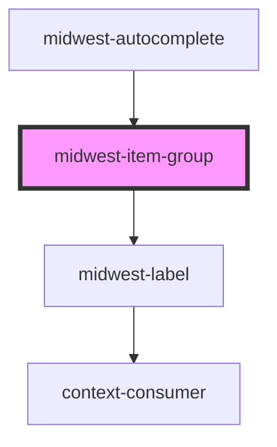

# midwest-item-group

<!-- Auto Generated Below -->

## Properties

| Property     | Attribute    | Description | Type      | Default     |
| ------------ | ------------ | ----------- | --------- | ----------- |
| `dark`       | `dark`       |             | `boolean` | `false`     |
| `name`       | `name`       |             | `string`  | `"group"`   |
| `supplement` | `supplement` |             | `string`  | `undefined` |

## Dependencies

### Used by

 - [midwest-autocomplete](../autocomplete)

### Depends on

- [midwest-label](../../common/label)

### Graph

----------------------------------------------

*Built with [StencilJS](https://stenciljs.com/)*
