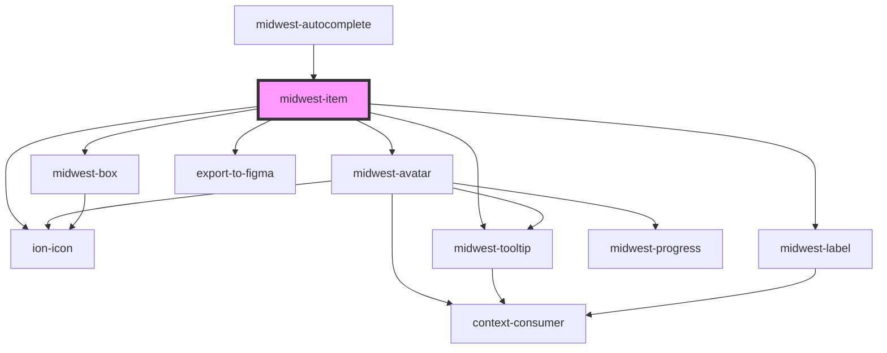

# midwest-item

<!-- Auto Generated Below -->

## Properties

| Property         | Attribute         | Description                                 | Type                                                                         | Default     |
| ---------------- | ----------------- | ------------------------------------------- | ---------------------------------------------------------------------------- | ----------- |
| `avatar`         | `avatar`          |                                             | `string`                                                                     | `undefined` |
| `avatarIcon`     | `avatar-icon`     |                                             | `string`                                                                     | `undefined` |
| `avatarShape`    | `avatar-shape`    |                                             | `"circle" \| "diamond" \| "hexagon" \| "message" \| "rectangle" \| "square"` | `"square"`  |
| `avatarSize`     | `avatar-size`     |                                             | `"medium" \| "small"`                                                        | `"small"`   |
| `avatarSrc`      | `avatar-src`      |                                             | `string`                                                                     | `undefined` |
| `block`          | `block`           |                                             | `boolean`                                                                    | `false`     |
| `checked`        | `checked`         |                                             | `boolean`                                                                    | `false`     |
| `content`        | `content`         |                                             | `string`                                                                     | `undefined` |
| `dark`           | `dark`            |                                             | `boolean`                                                                    | `false`     |
| `default`        | `default`         |                                             | `any`                                                                        | `undefined` |
| `disabled`       | `disabled`        |                                             | `boolean`                                                                    | `false`     |
| `export`         | `export`          | Makes sure this element cannot be exported. | `boolean`                                                                    | `undefined` |
| `focused`        | `focused`         |                                             | `boolean`                                                                    | `false`     |
| `group`          | `group`           |                                             | `string`                                                                     | `undefined` |
| `hasSelected`    | `has-selected`    |                                             | `boolean`                                                                    | `undefined` |
| `href`           | `href`            |                                             | `string`                                                                     | `"#"`       |
| `icon`           | `icon`            |                                             | `string`                                                                     | `undefined` |
| `inline`         | `inline`          |                                             | `boolean`                                                                    | `false`     |
| `name`           | `name`            |                                             | `string`                                                                     | `"item"`    |
| `quiet`          | `quiet`           |                                             | `boolean`                                                                    | `undefined` |
| `required`       | `required`        |                                             | `boolean`                                                                    | `false`     |
| `settableParent` | `settable-parent` |                                             | `any`                                                                        | `undefined` |
| `tag`            | `tag`             |                                             | `"a" \| "button" \| "checkbox" \| "radio" \| "span"`                         | `"button"`  |
| `target`         | `target`          |                                             | `string`                                                                     | `"_self"`   |
| `tooltip`        | `tooltip`         |                                             | `string`                                                                     | `undefined` |
| `value`          | `value`           |                                             | `string`                                                                     | `undefined` |

## Events

| Event              | Description | Type               |
| ------------------ | ----------- | ------------------ |
| `selectionChanged` |             | `CustomEvent<any>` |

## Methods

### `validate() => Promise<FormResult>`

#### Returns

Type: `Promise<FormResult>`

## Dependencies

### Used by

 - [midwest-autocomplete](../autocomplete)

### Depends on

- [midwest-avatar](../../common/avatar)
- ion-icon
- [midwest-box](../box)
- [midwest-label](../../common/label)
- [midwest-tooltip](../../common/tooltip)
- export-to-figma

### Graph

----------------------------------------------

*Built with [StencilJS](https://stenciljs.com/)*
