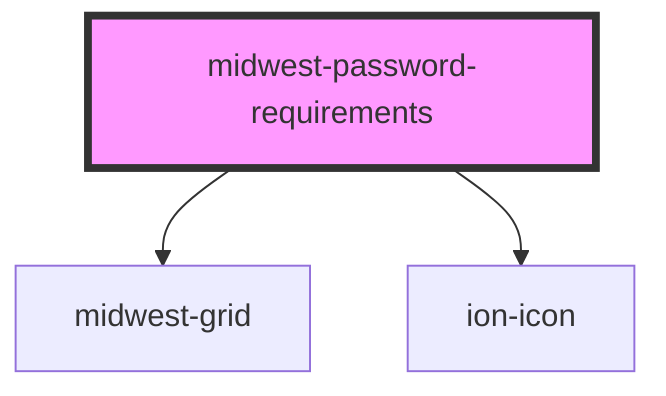

# midwest-password-requirements

<!-- Auto Generated Below -->

## Properties

| Property | Attribute | Description | Type                 | Default     |
| -------- | --------- | ----------- | -------------------- | ----------- |
| `for`    | `for`     |             | `string`             | `undefined` |
| `size`   | `size`    |             | `"large" \| "small"` | `undefined` |

## Dependencies

### Depends on

- [midwest-grid](../../common/grid)
- ion-icon

### Graph

----------------------------------------------

*Built with [StencilJS](https://stenciljs.com/)*
