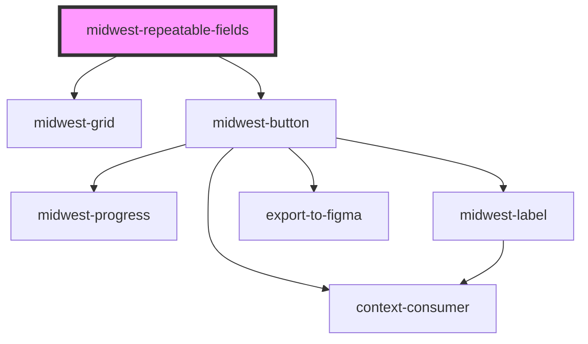

# midwest-repeatable-fields

<!-- Auto Generated Below -->

## Properties

| Property        | Attribute          | Description | Type      | Default     |
| --------------- | ------------------ | ----------- | --------- | ----------- |
| `addOneIfEmpty` | `add-one-if-empty` |             | `boolean` | `undefined` |
| `custom`        | `custom`           |             | `boolean` | `undefined` |
| `data`          | `data`             |             | `string`  | `undefined` |
| `readonly`      | `readonly`         |             | `boolean` | `false`     |
| `verbiage`      | `verbiage`         |             | `string`  | `"Item"`    |

## Events

| Event    | Description | Type               |
| -------- | ----------- | ------------------ |
| `update` |             | `CustomEvent<any>` |

## Methods

### `removeByIndex(index: number) => Promise<void>`

#### Returns

Type: `Promise<void>`

## Dependencies

### Depends on

- [midwest-grid](../../common/grid)
- [midwest-button](../../common/button)

### Graph

----------------------------------------------

*Built with [StencilJS](https://stenciljs.com/)*
