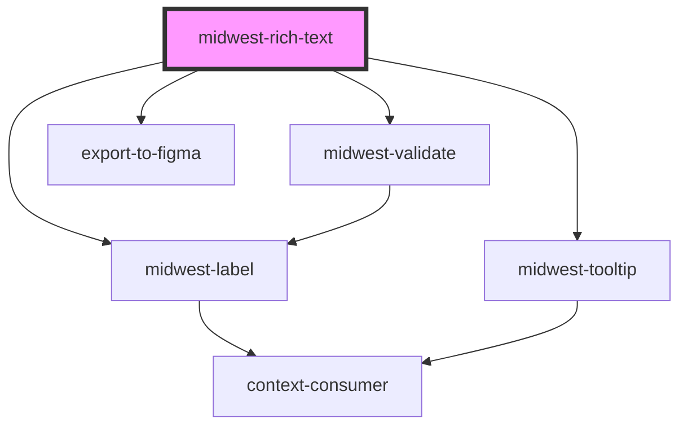

# midwest-rich-text

<!-- Auto Generated Below -->

## Properties

| Property              | Attribute          | Description                                    | Type                               | Default           |
| --------------------- | ------------------ | ---------------------------------------------- | ---------------------------------- | ----------------- |
| `dark`                | `dark`             | Sets the button or link as an outlined button. | `boolean`                          | `false`           |
| `description`         | `description`      |                                                | `string`                           | `undefined`       |
| `enableAlignment`     | `enable-alignment` |                                                | `boolean`                          | `undefined`       |
| `enableEmojis`        | `enable-emojis`    |                                                | `boolean`                          | `undefined`       |
| `enableImages`        | `enable-images`    |                                                | `boolean`                          | `undefined`       |
| `enableLinks`         | `enable-links`     |                                                | `boolean`                          | `undefined`       |
| `enableMentions`      | `enable-mentions`  |                                                | `boolean`                          | `undefined`       |
| `enableRich`          | `enable-rich`      |                                                | `boolean`                          | `undefined`       |
| `enableRicher`        | `enable-richer`    |                                                | `boolean`                          | `undefined`       |
| `export`              | `export`           | Hides this element from exporting to figma     | `boolean`                          | `undefined`       |
| `inline`              | `inline`           |                                                | `boolean`                          | `undefined`       |
| `label`               | `label`            |                                                | `string`                           | `undefined`       |
| `max`                 | `max`              |                                                | `number`                           | `undefined`       |
| `mentionDataFunction` | --                 |                                                | `() => void`                       | `undefined`       |
| `mentionsData`        | --                 |                                                | `{ id: string; value: string; }[]` | `[]`              |
| `name`                | `name`             |                                                | `string`                           | `"rich-text"`     |
| `novalidate`          | `novalidate`       |                                                | `boolean`                          | `undefined`       |
| `placeholder`         | `placeholder`      |                                                | `string`                           | `"Enter a value"` |
| `readonly`            | `readonly`         |                                                | `boolean`                          | `undefined`       |
| `required`            | `required`         |                                                | `boolean`                          | `undefined`       |
| `size`                | `size`             |                                                | `string`                           | `undefined`       |
| `tooltip`             | `tooltip`          |                                                | `string`                           | `undefined`       |
| `twitterBased`        | `twitter-based`    |                                                | `boolean`                          | `undefined`       |
| `valid`               | `valid`            |                                                | `boolean`                          | `undefined`       |
| `value`               | `value`            |                                                | `string`                           | `undefined`       |

## Events

| Event      | Description           | Type               |
| ---------- | --------------------- | ------------------ |
| `bluring`  | Public: Bluring event | `CustomEvent<any>` |
| `focusing` | Public: Bluring event | `CustomEvent<any>` |
| `update`   | Public: Updated event | `CustomEvent<any>` |

## Methods

### `getContents() => Promise<{ ops: DeltaOperation[]; html: string; text: string; }>`

#### Returns

Type: `Promise<{ ops: DeltaOperation[]; html: string; text: string; }>`

### `getEditor() => Promise<Quill>`

#### Returns

Type: `Promise<Quill>`

### `getStringifiedContents() => Promise<string>`

#### Returns

Type: `Promise<string>`

### `replace(needle: string, becomes: string) => Promise<void>`

#### Returns

Type: `Promise<void>`

### `setContents(json: string) => Promise<void>`

#### Returns

Type: `Promise<void>`

### `validate(set?: boolean) => Promise<FormResult>`

#### Returns

Type: `Promise<FormResult>`

## Dependencies

### Depends on

- [midwest-label](../../common/label)
- [midwest-tooltip](../../common/tooltip)
- [midwest-validate](../validate)
- export-to-figma

### Graph

----------------------------------------------

*Built with [StencilJS](https://stenciljs.com/)*
