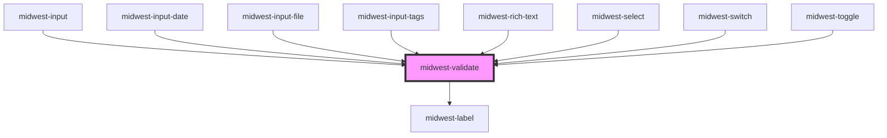

# midwest-validate

<!-- Auto Generated Below -->

## Properties

| Property       | Attribute | Description | Type                         | Default     |
| -------------- | --------- | ----------- | ---------------------------- | ----------- |
| `check`        | --        |             | `CustomFunction`             | `undefined` |
| `color`        | `color`   |             | `string`                     | `undefined` |
| `customRender` | --        |             | `(message: string[]) => any` | `undefined` |
| `element`      | `element` |             | `any`                        | `undefined` |
| `name`         | `name`    |             | `string`                     | `undefined` |
| `silent`       | `silent`  |             | `boolean`                    | `undefined` |
| `size`         | `size`    |             | `string`                     | `undefined` |

## Events

| Event       | Description | Type               |
| ----------- | ----------- | ------------------ |
| `correct`   |             | `CustomEvent<any>` |
| `incorrect` |             | `CustomEvent<any>` |
| `test`      |             | `CustomEvent<any>` |

## Methods

### `get() => Promise<FormResult>`

#### Returns

Type: `Promise<FormResult>`

### `validate(set?: boolean) => Promise<FormResult>`

#### Returns

Type: `Promise<FormResult>`

## Dependencies

### Used by

 - [midwest-input](../input)
 - [midwest-input-date](../input-date)
 - [midwest-input-file](../input-file)
 - [midwest-input-tags](../input-tags)
 - [midwest-rich-text](../rich-text)
 - [midwest-select](../select)
 - [midwest-switch](../switch)
 - [midwest-toggle](../toggle)

### Depends on

- [midwest-label](../../common/label)

### Graph

----------------------------------------------

*Built with [StencilJS](https://stenciljs.com/)*
