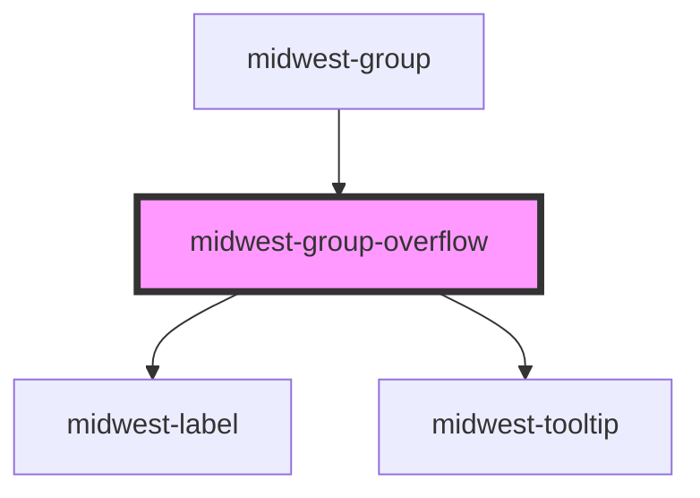

# midwest-group-overflow

<!-- Auto Generated Below -->

## Properties

| Property   | Attribute  | Description | Type      | Default     |
| ---------- | ---------- | ----------- | --------- | ----------- |
| `count`    | `count`    |             | `number`  | `undefined` |
| `tooltip`  | `tooltip`  |             | `boolean` | `undefined` |
| `verbiage` | `verbiage` |             | `string`  | `undefined` |

## Dependencies

### Used by

 - [midwest-group](../group)

### Depends on

- [midwest-label](../label)
- [midwest-tooltip](../tooltip)

### Graph

----------------------------------------------

*Built with [StencilJS](https://stenciljs.com/)*
