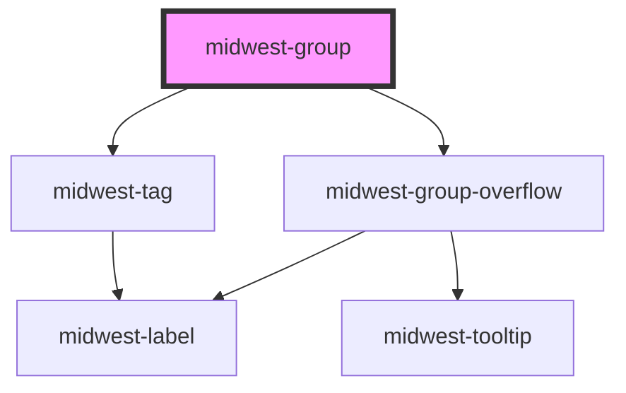

# midwest-group

<!-- Auto Generated Below -->

## Usage

### Buttons

<midwest-group>
	<midwest-button>Nice</midwest-button>
	<midwest-button>Awesome</midwest-button>
</midwest-group>

### Cards

<midwest-group fill>
	<midwest-card>
		<copy-wrap align="center">
			<h1>$10/month</h1>
			<ul class="mt4">
				<li>unlimited whtachamacallits</li>
				<li>unlimited whtachamacallits</li>
				<li>unlimited whtachamacallits</li>
			</ul>
		</copy-wrap>
	</midwest-card>
	<midwest-card emphasis>
		<copy-wrap align="center">
			<h1>$20/month</h1>
			<ul class="mt4">
				<li>unlimited whtachamacallits</li>
				<li>unlimited whtachamacallits</li>
				<li>unlimited whtachamacallits</li>
				<li>unlimited whtachamacallits</li>
				<li>unlimited whtachamacallits</li>
			</ul>
		</copy-wrap>
	</midwest-card>
	<midwest-card>
		<copy-wrap align="center">
			<h1>$30/month</h1>
			<ul class="mt4">
				<li>unlimited whtachamacallits</li>
				<li>unlimited whtachamacallits</li>
				<li>unlimited whtachamacallits</li>
				<li>unlimited whtachamacallits</li>
				<li>unlimited whtachamacallits</li>
				<li>unlimited whtachamacallits</li>
				<li>unlimited whtachamacallits</li>
			</ul>
		</copy-wrap>
	</midwest-card>
</midwest-group>

### Default / inputs

<midwest-group>
	<midwest-input type="text"></midwest-input>
	<midwest-input type="text"></midwest-input>
</midwest-group>

### Mixed

<midwest-group fill>
	<midwest-input></midwest-input>
	<midwest-button>Cool!</midwest-button>
</midwest-group>

 

<midwest-group fill>
	<midwest-button>Cool!</midwest-button>
	<midwest-input></midwest-input>
</midwest-group>

 

<midwest-group fill>
	<midwest-input size="tiny"></midwest-input>
	<midwest-button size="tiny">Cool!</midwest-button>
</midwest-group>

 

<midwest-group fill>
	<midwest-button size="tiny">Cool!</midwest-button>
	<midwest-input size="tiny"></midwest-input>
</midwest-group>

 

<midwest-group fill>
	<midwest-input size="small"></midwest-input>
	<midwest-button size="small">Cool!</midwest-button>
</midwest-group>

 

<midwest-group fill>
	<midwest-button size="small">Cool!</midwest-button>
	<midwest-input size="small"></midwest-input>
</midwest-group>

 

<midwest-group fill>
	<midwest-input size="medium"></midwest-input>
	<midwest-button size="medium">Cool!</midwest-button>
</midwest-group>

 

<midwest-group fill>
	<midwest-button size="medium">Cool!</midwest-button>
	<midwest-input size="medium"></midwest-input>
</midwest-group>

 

<midwest-group fill>
	<midwest-input size="large"></midwest-input>
	<midwest-button size="large">Cool!</midwest-button>
</midwest-group>

 

<midwest-group fill>
	<midwest-button size="large">Cool!</midwest-button>
	<midwest-input size="large"></midwest-input>
</midwest-group>

## Properties

| Property   | Attribute  | Description                                    | Type      | Default     |
| ---------- | ---------- | ---------------------------------------------- | --------- | ----------- |
| `avatars`  | `avatars`  |                                                | `boolean` | `undefined` |
| `buttons`  | `buttons`  |                                                | `boolean` | `undefined` |
| `choice`   | `choice`   |                                                | `boolean` | `undefined` |
| `count`    | `count`    |                                                | `number`  | `4`         |
| `dark`     | `dark`     | Sets the button or link as an outlined button. | `boolean` | `false`     |
| `extras`   | `extras`   |                                                | `number`  | `undefined` |
| `overflow` | `overflow` |                                                | `boolean` | `undefined` |
| `size`     | `size`     |                                                | `string`  | `undefined` |
| `verbiage` | `verbiage` |                                                | `string`  | `undefined` |

## Dependencies

### Depends on

- [midwest-tag](../tag)
- [midwest-group-overflow](../group-overflow)

### Graph

----------------------------------------------

*Built with [StencilJS](https://stenciljs.com/)*
