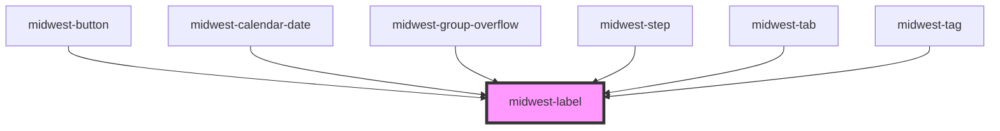

# midwest-label

<!-- Auto Generated Below -->

## Properties

| Property     | Attribute    | Description | Type      | Default     |
| ------------ | ------------ | ----------- | --------- | ----------- |
| `dark`       | `dark`       |             | `boolean` | `false`     |
| `for`        | `for`        |             | `string`  | `undefined` |
| `size`       | `size`       |             | `string`  | `undefined` |
| `underneath` | `underneath` |             | `boolean` | `undefined` |

## Dependencies

### Used by

 - [midwest-button](../button)
 - [midwest-calendar-date](../calendar-date)
 - [midwest-group-overflow](../group-overflow)
 - [midwest-step](../step)
 - [midwest-tab](../tab)
 - [midwest-tag](../tag)

### Graph

----------------------------------------------

*Built with [StencilJS](https://stenciljs.com/)*
