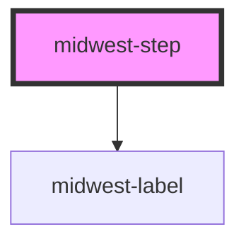

# midwest-step

<!-- Auto Generated Below -->

## Properties

| Property   | Attribute   | Description | Type      | Default     |
| ---------- | ----------- | ----------- | --------- | ----------- |
| `complete` | `complete`  |             | `boolean` | `false`     |
| `current`  | `current`   |             | `boolean` | `false`     |
| `dark`     | `dark`      |             | `boolean` | `undefined` |
| `disabled` | `disabled`  |             | `boolean` | `false`     |
| `href`     | `href`      |             | `string`  | `"#"`       |
| `open`     | `open`      |             | `boolean` | `false`     |
| `order`    | `order`     |             | `number`  | `undefined` |
| `past`     | `past`      |             | `boolean` | `false`     |
| `tabCount` | `tab-count` |             | `number`  | `undefined` |

## Events

| Event           | Description | Type               |
| --------------- | ----------- | ------------------ |
| `contentChange` |             | `CustomEvent<any>` |

## Methods

### `activate() => Promise<void>`

#### Returns

Type: `Promise<void>`

## Dependencies

### Depends on

- [midwest-label](../label)

### Graph

----------------------------------------------

*Built with [StencilJS](https://stenciljs.com/)*
