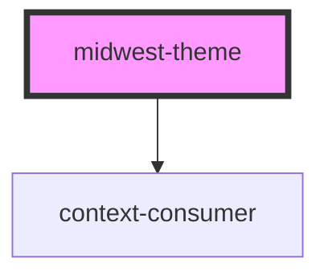

# midwest-theme

<!-- Auto Generated Below -->

## Properties

| Property     | Attribute    | Description | Type                                                                                                                                                  | Default               |
| ------------ | ------------ | ----------- | ----------------------------------------------------------------------------------------------------------------------------------------------------- | --------------------- |
| `base`       | `base`       |             | `"blue" \| "cyan" \| "gold" \| "gray" \| "green" \| "indigo" \| "lime" \| "magenta" \| "orange" \| "pink" \| "red" \| "teal" \| "violet" \| "yellow"` | `"red"`               |
| `body`       | `body`       |             | `boolean`                                                                                                                                             | `false`               |
| `colors`     | --           |             | `string[]`                                                                                                                                            | `Object.keys(colors)` |
| `complement` | `complement` |             | `"blue" \| "cyan" \| "gold" \| "gray" \| "green" \| "indigo" \| "lime" \| "magenta" \| "orange" \| "pink" \| "red" \| "teal" \| "violet" \| "yellow"` | `"indigo"`            |
| `dark`       | `dark`       |             | `boolean`                                                                                                                                             | `false`               |
| `light`      | `light`      |             | `boolean`                                                                                                                                             | `false`               |
| `system`     | `system`     |             | `boolean`                                                                                                                                             | `false`               |

## Dependencies

### Depends on

- context-consumer

### Graph

----------------------------------------------

*Built with [StencilJS](https://stenciljs.com/)*
