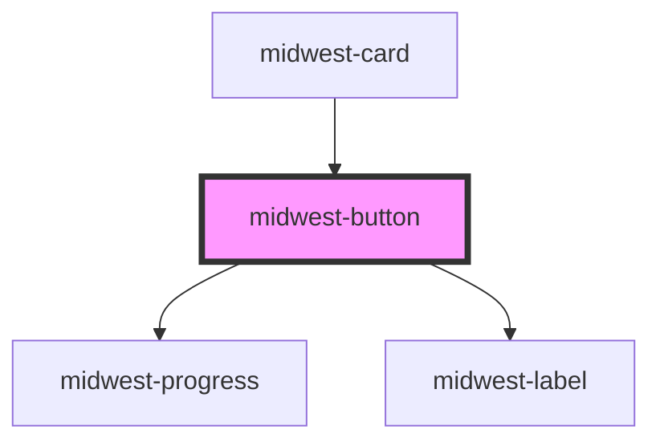

# midwest-button

<!-- Auto Generated Below -->

## Properties

| Property            | Attribute            | Description | Type                                                                                     | Default     |
| ------------------- | -------------------- | ----------- | ---------------------------------------------------------------------------------------- | ----------- |
| `activate`          | `activate`           |             | `string`                                                                                 | `undefined` |
| `active`            | `active`             |             | `boolean`                                                                                | `false`     |
| `authenticityToken` | `authenticity-token` |             | `string`                                                                                 | `undefined` |
| `block`             | `block`              |             | `boolean`                                                                                | `false`     |
| `buttonTabIndex`    | `button-tab-index`   |             | `number`                                                                                 | `0`         |
| `circle`            | `circle`             |             | `boolean`                                                                                | `false`     |
| `confirm`           | `confirm`            |             | `string`                                                                                 | `undefined` |
| `contrast`          | `contrast`           |             | `boolean`                                                                                | `false`     |
| `dark`              | `dark`               |             | `boolean`                                                                                | `false`     |
| `disabled`          | `disabled`           |             | `boolean`                                                                                | `false`     |
| `export`            | `export`             |             | `boolean`                                                                                | `undefined` |
| `for`               | `for`                |             | `string`                                                                                 | `undefined` |
| `ghost`             | `ghost`              |             | `boolean`                                                                                | `false`     |
| `href`              | `href`               |             | `string`                                                                                 | `'#'`       |
| `icon`              | `icon`               |             | `boolean`                                                                                | `false`     |
| `iconOnly`          | `icon-only`          |             | `boolean`                                                                                | `false`     |
| `invert`            | `invert`             |             | `boolean`                                                                                | `false`     |
| `label`             | `label`              |             | `string`                                                                                 | `'Submit'`  |
| `method`            | `method`             |             | `"delete" \| "get" \| "patch" \| "post" \| "put"`                                        | `undefined` |
| `modalHref`         | `modal-href`         |             | `string`                                                                                 | `undefined` |
| `name`              | `name`               |             | `string`                                                                                 | `undefined` |
| `outline`           | `outline`            |             | `boolean`                                                                                | `false`     |
| `padding`           | `padding`            |             | `"default" \| "large" \| "small" \| "tiny"`                                              | `'default'` |
| `pill`              | `pill`               |             | `boolean`                                                                                | `false`     |
| `pjaxSelector`      | `pjax-selector`      |             | `string`                                                                                 | `undefined` |
| `processable`       | `processable`        |             | `boolean`                                                                                | `false`     |
| `processing`        | `processing`         |             | `boolean`                                                                                | `false`     |
| `sideEffect`        | `side-effect`        |             | `"close-modal" \| "copy"`                                                                | `undefined` |
| `sidebar`           | `sidebar`            |             | `boolean`                                                                                | `undefined` |
| `size`              | `size`               |             | `"default" \| "large" \| "small" \| "tiny"`                                              | `'default'` |
| `stopPropagation`   | `stop-propagation`   |             | `boolean`                                                                                | `undefined` |
| `tag`               | `tag`                |             | `"button" \| "link" \| "modal" \| "onboarding" \| "span" \| "stencil-route" \| "submit"` | `'link'`    |
| `target`            | `target`             |             | `string`                                                                                 | `'_self'`   |
| `usePjax`           | `use-pjax`           |             | `boolean`                                                                                | `true`      |
| `value`             | `value`              |             | `string`                                                                                 | `undefined` |

## Events

| Event             | Description | Type               |
| ----------------- | ----------- | ------------------ |
| `confirmed`       |             | `CustomEvent<any>` |
| `modalClose`      |             | `CustomEvent<any>` |
| `modalOpen`       |             | `CustomEvent<any>` |
| `onboardingClose` |             | `CustomEvent<any>` |
| `onboardingOpen`  |             | `CustomEvent<any>` |

## Methods

### `fireClick() => Promise<void>`

#### Returns

Type: `Promise<void>`

## Dependencies

### Used by

 - [midwest-card](../card)

### Depends on

- [midwest-progress](../progress)
- [midwest-label](../label)

### Graph

----------------------------------------------

*Built with [StencilJS](https://stenciljs.com/)*
