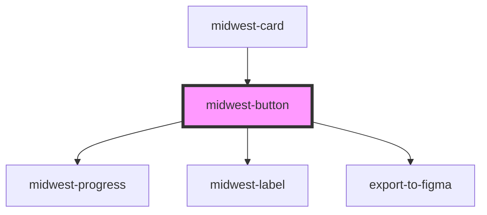

# midwest-button

<!-- Auto Generated Below -->

## Properties

| Property         | Attribute          | Description | Type                                                                                     | Default     |
| ---------------- | ------------------ | ----------- | ---------------------------------------------------------------------------------------- | ----------- |
| `active`         | `active`           |             | `boolean`                                                                                | `false`     |
| `block`          | `block`            |             | `boolean`                                                                                | `false`     |
| `buttonTabIndex` | `button-tab-index` |             | `number`                                                                                 | `0`         |
| `confirm`        | `confirm`          |             | `string`                                                                                 | `undefined` |
| `contrast`       | `contrast`         |             | `boolean`                                                                                | `false`     |
| `dark`           | `dark`             |             | `boolean`                                                                                | `false`     |
| `disabled`       | `disabled`         |             | `boolean`                                                                                | `false`     |
| `export`         | `export`           |             | `boolean`                                                                                | `undefined` |
| `for`            | `for`              |             | `string`                                                                                 | `undefined` |
| `ghost`          | `ghost`            |             | `boolean`                                                                                | `false`     |
| `href`           | `href`             |             | `string`                                                                                 | `'#'`       |
| `icon`           | `icon`             |             | `boolean`                                                                                | `false`     |
| `iconOnly`       | `icon-only`        |             | `boolean`                                                                                | `false`     |
| `invert`         | `invert`           |             | `boolean`                                                                                | `false`     |
| `label`          | `label`            |             | `string`                                                                                 | `'Submit'`  |
| `modalHref`      | `modal-href`       |             | `string`                                                                                 | `undefined` |
| `name`           | `name`             |             | `string`                                                                                 | `undefined` |
| `outline`        | `outline`          |             | `boolean`                                                                                | `false`     |
| `padding`        | `padding`          |             | `"large" \| "small" \| "tiny"`                                                           | `undefined` |
| `pill`           | `pill`             |             | `boolean`                                                                                | `false`     |
| `pjaxSelector`   | `pjax-selector`    |             | `string`                                                                                 | `undefined` |
| `processable`    | `processable`      |             | `boolean`                                                                                | `false`     |
| `processing`     | `processing`       |             | `boolean`                                                                                | `false`     |
| `size`           | `size`             |             | `"large" \| "small" \| "tiny"`                                                           | `undefined` |
| `tag`            | `tag`              |             | `"button" \| "link" \| "modal" \| "onboarding" \| "span" \| "stencil-route" \| "submit"` | `"link"`    |
| `target`         | `target`           |             | `string`                                                                                 | `'_self'`   |
| `usePjax`        | `use-pjax`         |             | `boolean`                                                                                | `true`      |
| `value`          | `value`            |             | `string`                                                                                 | `undefined` |

## Events

| Event              | Description | Type               |
| ------------------ | ----------- | ------------------ |
| `modal:close`      |             | `CustomEvent<any>` |
| `modal:open`       |             | `CustomEvent<any>` |
| `onboarding:close` |             | `CustomEvent<any>` |
| `onboarding:open`  |             | `CustomEvent<any>` |

## Dependencies

### Used by

 - [midwest-card](../card)

### Depends on

- [midwest-progress](../progress)
- [midwest-label](../label)
- export-to-figma

### Graph

----------------------------------------------

*Built with [StencilJS](https://stenciljs.com/)*
