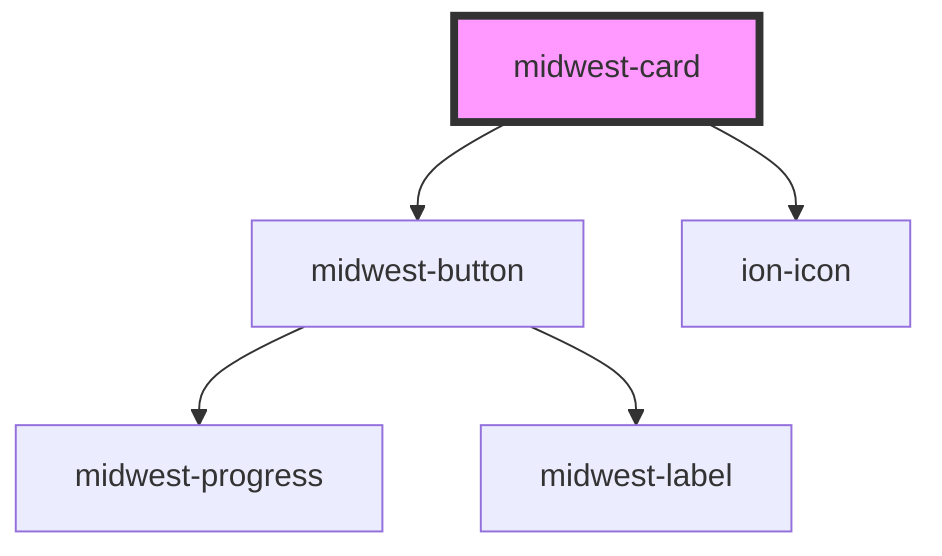

# midwest-card

<!-- Auto Generated Below -->

## Properties

| Property         | Attribute         | Description | Type                                                 | Default     |
| ---------------- | ----------------- | ----------- | ---------------------------------------------------- | ----------- |
| `backHeight`     | `back-height`     |             | `number`                                             | `undefined` |
| `block`          | `block`           |             | `boolean`                                            | `false`     |
| `compact`        | `compact`         |             | `boolean`                                            | `false`     |
| `dark`           | `dark`            |             | `boolean`                                            | `false`     |
| `export`         | `export`          |             | `boolean`                                            | `undefined` |
| `flipIcon`       | `flip-icon`       |             | `string`                                             | `"create"`  |
| `flipReady`      | `flip-ready`      |             | `boolean`                                            | `false`     |
| `flippable`      | `flippable`       |             | `boolean`                                            | `false`     |
| `flipped`        | `flipped`         |             | `boolean`                                            | `false`     |
| `for`            | `for`             |             | `string`                                             | `undefined` |
| `horizontal`     | `horizontal`      |             | `boolean`                                            | `undefined` |
| `href`           | `href`            |             | `string`                                             | `"#"`       |
| `modalHref`      | `modal-href`      |             | `string`                                             | `undefined` |
| `name`           | `name`            |             | `string`                                             | `""`        |
| `originalHeight` | `original-height` |             | `number`                                             | `undefined` |
| `padding`        | `padding`         |             | `"large" \| "medium" \| "none" \| "small" \| "tiny"` | `"medium"`  |
| `small`          | `small`           |             | `boolean`                                            | `false`     |
| `smallSize`      | `small-size`      |             | `number`                                             | `350`       |
| `tag`            | `tag`             |             | `"a" \| "button" \| "div" \| "modal"`                | `"div"`     |
| `type`           | `type`            |             | `string`                                             | `undefined` |
| `value`          | `value`           |             | `string`                                             | `"#"`       |

## Events

| Event         | Description | Type               |
| ------------- | ----------- | ------------------ |
| `flip`        |             | `CustomEvent<any>` |
| `modal:close` |             | `CustomEvent<any>` |
| `modal:open`  |             | `CustomEvent<any>` |

## Methods

### `flip_card() => Promise<void>`

#### Returns

Type: `Promise<void>`

## Dependencies

### Depends on

- [midwest-button](../button)
- ion-icon

### Graph

----------------------------------------------

*Built with [StencilJS](https://stenciljs.com/)*
