# midwest-label

<!-- Auto Generated Below -->

## Properties

| Property             | Attribute             | Description                                    | Type                                                                                       | Default       |
| -------------------- | --------------------- | ---------------------------------------------- | ------------------------------------------------------------------------------------------ | ------------- |
| `color`              | `color`               |                                                | `string`                                                                                   | `"black"`     |
| `colorIntensity`     | `color-intensity`     |                                                | `number`                                                                                   | `5`           |
| `dark`               | `dark`                | Sets the button or link as an outlined button. | `boolean`                                                                                  | `false`       |
| `for`                | `for`                 |                                                | `string`                                                                                   | `undefined`   |
| `italicized`         | `italicized`          |                                                | `boolean`                                                                                  | `undefined`   |
| `size`               | `size`                |                                                | `string`                                                                                   | `undefined`   |
| `textTransformation` | `text-transformation` |                                                | `"capitalize" \| "full-size-kana" \| "full-width" \| "lowercase" \| "none" \| "uppercase"` | `"uppercase"` |
| `underneath`         | `underneath`          |                                                | `boolean`                                                                                  | `undefined`   |

## Dependencies

### Used by

 - [midwest-breadcrumbs](../breadcrumbs)
 - [midwest-button](../button)
 - [midwest-calendar-date](../calendar-date)
 - [midwest-datetime-picker](../../forms/datetime-picker)
 - [midwest-form-rollup](../../forms/form-rollup)
 - [midwest-group-overflow](../group-overflow)
 - [midwest-input](../../forms/input)
 - [midwest-input-date](../../forms/input-date)
 - [midwest-input-file](../../forms/input-file)
 - [midwest-input-tags](../../forms/input-tags)
 - [midwest-item](../../forms/item)
 - [midwest-item-group](../../forms/item-group)
 - [midwest-rich-text](../../forms/rich-text)
 - [midwest-select](../../forms/select)
 - [midwest-step](../step)
 - [midwest-switch](../../forms/switch)
 - [midwest-tab](../tab)
 - [midwest-tag](../tag)
 - [midwest-toggle](../../forms/toggle)
 - [midwest-validate](../../forms/validate)

### Graph

```mermaid
graph TD;
  midwest-breadcrumbs --> midwest-label
  midwest-button --> midwest-label
  midwest-calendar-date --> midwest-label
  midwest-datetime-picker --> midwest-label
  midwest-form-rollup --> midwest-label
  midwest-group-overflow --> midwest-label
  midwest-input --> midwest-label
  midwest-input-date --> midwest-label
  midwest-input-file --> midwest-label
  midwest-input-tags --> midwest-label
  midwest-item --> midwest-label
  midwest-item-group --> midwest-label
  midwest-rich-text --> midwest-label
  midwest-select --> midwest-label
  midwest-step --> midwest-label
  midwest-switch --> midwest-label
  midwest-tab --> midwest-label
  midwest-tag --> midwest-label
  midwest-toggle --> midwest-label
  midwest-validate --> midwest-label
  style midwest-label fill:#f9f,stroke:#333,stroke-width:4px
```

----------------------------------------------

*Built with [StencilJS](https://stenciljs.com/)*
