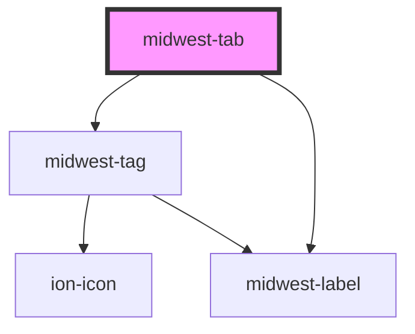

# midwest-tab

<!-- Auto Generated Below -->

## Properties

| Property             | Attribute             | Description                                                | Type                                       | Default     |
| -------------------- | --------------------- | ---------------------------------------------------------- | ------------------------------------------ | ----------- |
| `dark`               | `dark`                |                                                            | `boolean`                                  | `false`     |
| `disabled`           | `disabled`            |                                                            | `boolean`                                  | `false`     |
| `href`               | `href`                | Sets the href on the anchor tag if the button is a link.   | `string`                                   | `'#'`       |
| `name`               | `name`                |                                                            | `string`                                   | `undefined` |
| `notifications`      | `notifications`       |                                                            | `boolean \| number`                        | `false`     |
| `notificationsColor` | `notifications-color` |                                                            | `string`                                   | `"cyan"`    |
| `open`               | `open`                |                                                            | `boolean`                                  | `false`     |
| `order`              | `order`               |                                                            | `number`                                   | `undefined` |
| `size`               | `size`                |                                                            | `"large" \| "medium" \| "small" \| "tiny"` | `"medium"`  |
| `tabCount`           | `tab-count`           |                                                            | `number`                                   | `undefined` |
| `tag`                | `tag`                 |                                                            | `"button" \| "link" \| "stencil-route"`    | `"button"`  |
| `target`             | `target`              | Sets the target on the anchor tag if the button is a link. | `string`                                   | `'_self'`   |
| `vertical`           | `vertical`            |                                                            | `boolean`                                  | `false`     |

## Events

| Event           | Description | Type               |
| --------------- | ----------- | ------------------ |
| `contentChange` |             | `CustomEvent<any>` |

## Methods

### `activate() => Promise<void>`

#### Returns

Type: `Promise<void>`

## Dependencies

### Depends on

- [midwest-tag](../tag)
- [midwest-label](../label)

### Graph

----------------------------------------------

*Built with [StencilJS](https://stenciljs.com/)*
