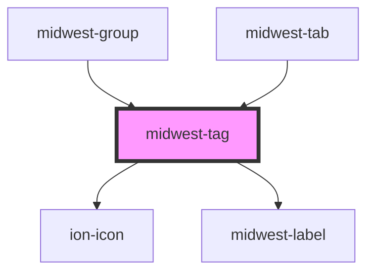

# midwest-tag

<!-- Auto Generated Below -->

## Usage

### Colors

<midwest-tag color="theme-base5">Theming</midwest-tag>
<midwest-tag color="theme-complement5">Theming</midwest-tag>

<midwest-tag color="red5">Awesome</midwest-tag>
<midwest-tag color="orange5">Awesome</midwest-tag>
<midwest-tag color="yellow5">Awesome</midwest-tag>
<midwest-tag color="lime5">Awesome</midwest-tag>
<midwest-tag color="green5">Awesome</midwest-tag>
<midwest-tag color="cyan5">Awesome</midwest-tag>
<midwest-tag color="blue5">Awesome</midwest-tag>
<midwest-tag color="indigo5">Awesome</midwest-tag>
<midwest-tag color="violet5">Awesome</midwest-tag>
<midwest-tag color="fuschia5">Awesome</midwest-tag>
<midwest-tag color="pink5">Awesome</midwest-tag>
<midwest-tag color="gray5">Awesome</midwest-tag>

### Default

<midwest-tag>Awesome</midwest-tag>

### Pill

<midwest-tag size="tiny" pill>Awesome</midwest-tag>
<midwest-tag size="small" pill>Awesome</midwest-tag>
<midwest-tag pill>Awesome</midwest-tag>
<midwest-tag size="medium" pill>Awesome</midwest-tag>
<midwest-tag size="large" pill>Awesome</midwest-tag>

### Sizes

<midwest-tag size="tiny">Awesome</midwest-tag>
<midwest-tag size="small">Awesome</midwest-tag>
<midwest-tag>Awesome</midwest-tag>
<midwest-tag size="medium">Awesome</midwest-tag>
<midwest-tag size="large">Awesome</midwest-tag>

## Properties

| Property     | Attribute    | Description | Type                                                                                                                                                  | Default     |
| ------------ | ------------ | ----------- | ----------------------------------------------------------------------------------------------------------------------------------------------------- | ----------- |
| `base`       | `base`       |             | `"blue" \| "cyan" \| "gold" \| "gray" \| "green" \| "indigo" \| "lime" \| "magenta" \| "orange" \| "pink" \| "red" \| "teal" \| "violet" \| "yellow"` | `undefined` |
| `color`      | `color`      |             | `"blue" \| "cyan" \| "gold" \| "gray" \| "green" \| "indigo" \| "lime" \| "magenta" \| "orange" \| "pink" \| "red" \| "teal" \| "violet" \| "yellow"` | `"gray"`    |
| `complement` | `complement` |             | `"blue" \| "cyan" \| "gold" \| "gray" \| "green" \| "indigo" \| "lime" \| "magenta" \| "orange" \| "pink" \| "red" \| "teal" \| "violet" \| "yellow"` | `undefined` |
| `dark`       | `dark`       |             | `boolean`                                                                                                                                             | `false`     |
| `icon`       | `icon`       |             | `string`                                                                                                                                              | `undefined` |
| `outline`    | `outline`    |             | `boolean`                                                                                                                                             | `false`     |
| `pill`       | `pill`       |             | `boolean`                                                                                                                                             | `false`     |
| `size`       | `size`       |             | `"large" \| "small" \| "tiny"`                                                                                                                        | `undefined` |

## Dependencies

### Used by

 - [midwest-group](../group)
 - [midwest-tab](../tab)

### Depends on

- ion-icon
- [midwest-label](../label)

### Graph

----------------------------------------------

*Built with [StencilJS](https://stenciljs.com/)*
