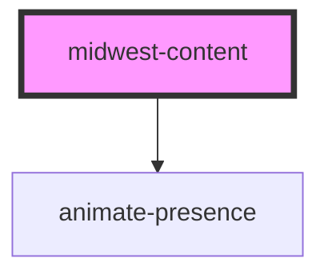

# midwest-content

<!-- Auto Generated Below -->

## Properties

| Property           | Attribute            | Description | Type      | Default     |
| ------------------ | -------------------- | ----------- | --------- | ----------- |
| `behavior`         | `behavior`           |             | `string`  | `undefined` |
| `for`              | `for`                |             | `string`  | `undefined` |
| `open`             | `open`               |             | `boolean` | `false`     |
| `scrollWhenActive` | `scroll-when-active` |             | `boolean` | `undefined` |

## Dependencies

### Depends on

- animate-presence

### Graph

----------------------------------------------

*Built with [StencilJS](https://stenciljs.com/)*
