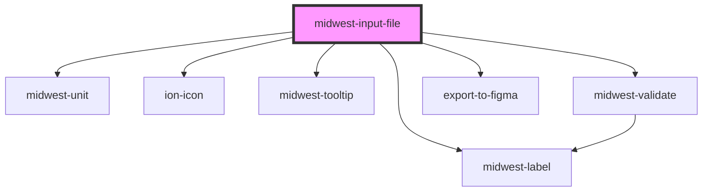

# midwest-input-file

<!-- Auto Generated Below -->

## Properties

| Property              | Attribute               | Description                                    | Type                              | Default           |
| --------------------- | ----------------------- | ---------------------------------------------- | --------------------------------- | ----------------- |
| `accept`              | `accept`                |                                                | `string`                          | `undefined`       |
| `dark`                | `dark`                  | Sets the button to dark.                       | `boolean`                         | `false`           |
| `description`         | `description`           |                                                | `string`                          | `undefined`       |
| `disabled`            | `disabled`              |                                                | `boolean`                         | `undefined`       |
| `droppable`           | `droppable`             |                                                | `boolean`                         | `false`           |
| `export`              | `export`                | Hides this element from exporting to figma     | `boolean`                         | `undefined`       |
| `files`               | --                      |                                                | `any[]`                           | `[]`              |
| `focused`             | `focused`               |                                                | `boolean`                         | `false`           |
| `hideState`           | `hide-state`            |                                                | `boolean`                         | `false`           |
| `inputTabIndex`       | `input-tab-index`       |                                                | `number`                          | `0`               |
| `label`               | `label`                 |                                                | `string`                          | `undefined`       |
| `multiple`            | `multiple`              |                                                | `boolean`                         | `false`           |
| `multipleFileCaption` | `multiple-file-caption` |                                                | `string`                          | `'{count} files'` |
| `name`                | `name`                  | The name of the input element                  | `string`                          | `undefined`       |
| `novalidate`          | `novalidate`            |                                                | `boolean`                         | `false`           |
| `placeholder`         | `placeholder`           |                                                | `string`                          | `"Enter a value"` |
| `readonly`            | `readonly`              |                                                | `boolean`                         | `false`           |
| `replacePlaceholder`  | `replace-placeholder`   |                                                | `string`                          | `"Replace file"`  |
| `required`            | `required`              |                                                | `boolean`                         | `false`           |
| `size`                | `size`                  |                                                | `"default" \| "large" \| "small"` | `"default"`       |
| `tooltip`             | `tooltip`               |                                                | `string`                          | `undefined`       |
| `value`               | `value`                 | The pre-set value to pass to the input element | `any`                             | `undefined`       |

## Events

| Event      | Description           | Type               |
| ---------- | --------------------- | ------------------ |
| `bluring`  | Public: Blur event    | `CustomEvent<any>` |
| `focusing` | Public: Focus event   | `CustomEvent<any>` |
| `update`   | Public: Updated event | `CustomEvent<any>` |

## Methods

### `validate(set?: boolean) => Promise<FormResult>`

#### Returns

Type: `Promise<FormResult>`

## Dependencies

### Depends on

- [midwest-unit](../../common/unit)
- ion-icon
- [midwest-label](../../common/label)
- [midwest-tooltip](../../common/tooltip)
- [midwest-validate](../validate)
- export-to-figma

### Graph

----------------------------------------------

*Built with [StencilJS](https://stenciljs.com/)*
