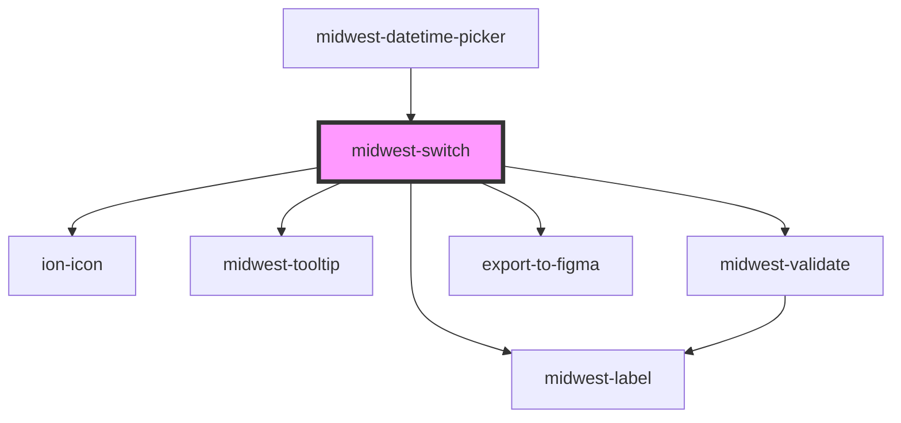

# midwest-switch

<!-- Auto Generated Below -->

## Properties

| Property         | Attribute         | Description                                    | Type                                                                                                                                                  | Default     |
| ---------------- | ----------------- | ---------------------------------------------- | ----------------------------------------------------------------------------------------------------------------------------------------------------- | ----------- |
| `base`           | `base`            |                                                | `"blue" \| "cyan" \| "gold" \| "gray" \| "green" \| "indigo" \| "lime" \| "magenta" \| "orange" \| "pink" \| "red" \| "teal" \| "violet" \| "yellow"` | `undefined` |
| `changeTheme`    | `change-theme`    |                                                | `boolean`                                                                                                                                             | `undefined` |
| `checked`        | `checked`         |                                                | `boolean`                                                                                                                                             | `false`     |
| `checkedDefault` | `checked-default` |                                                | `boolean`                                                                                                                                             | `false`     |
| `dark`           | `dark`            | Sets the button or link as an outlined button. | `boolean`                                                                                                                                             | `false`     |
| `description`    | `description`     |                                                | `string`                                                                                                                                              | `undefined` |
| `disabled`       | `disabled`        |                                                | `boolean`                                                                                                                                             | `false`     |
| `export`         | `export`          | Hides this element from exporting to figma     | `boolean`                                                                                                                                             | `undefined` |
| `label`          | `label`           |                                                | `string`                                                                                                                                              | `undefined` |
| `name`           | `name`            |                                                | `string`                                                                                                                                              | `undefined` |
| `noValue`        | `no-value`        |                                                | `string`                                                                                                                                              | `"false"`   |
| `novalidate`     | `novalidate`      |                                                | `boolean`                                                                                                                                             | `undefined` |
| `required`       | `required`        |                                                | `boolean`                                                                                                                                             | `undefined` |
| `size`           | `size`            |                                                | `"default" \| "large" \| "small"`                                                                                                                     | `"default"` |
| `tooltip`        | `tooltip`         |                                                | `string`                                                                                                                                              | `undefined` |
| `value`          | `value`           |                                                | `boolean \| string`                                                                                                                                   | `undefined` |
| `yesValue`       | `yes-value`       |                                                | `string`                                                                                                                                              | `"true"`    |

## Events

| Event    | Description | Type               |
| -------- | ----------- | ------------------ |
| `update` |             | `CustomEvent<any>` |

## Methods

### `activate(event?: any) => Promise<void>`

#### Returns

Type: `Promise<void>`

### `validate(set?: boolean) => Promise<FormResult>`

#### Returns

Type: `Promise<FormResult>`

## Dependencies

### Used by

 - [midwest-datetime-picker](../datetime-picker)

### Depends on

- [midwest-label](../../common/label)
- ion-icon
- [midwest-tooltip](../../common/tooltip)
- [midwest-validate](../validate)
- export-to-figma

### Graph

----------------------------------------------

*Built with [StencilJS](https://stenciljs.com/)*
