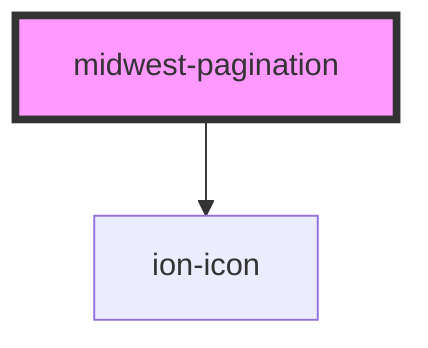

# midwest-pagination

<!-- Auto Generated Below -->

## Properties

| Property  | Attribute | Description                                            | Type                  | Default       |
| --------- | --------- | ------------------------------------------------------ | --------------------- | ------------- |
| `current` | `current` |                                                        | `number`              | `1`           |
| `dark`    | `dark`    |                                                        | `boolean`             | `false`       |
| `padding` | `padding` |                                                        | `number`              | `2`           |
| `pages`   | `pages`   | Public: Sets the max cap of pages you can skip through | `number`              | `1`           |
| `type`    | `type`    |                                                        | `"compact" \| "full"` | `"full"`      |
| `url`     | `url`     |                                                        | `any`                 | `"#page-{0}"` |

## Events

| Event     | Description | Type               |
| --------- | ----------- | ------------------ |
| `changed` |             | `CustomEvent<any>` |

## Methods

### `first() => Promise<void>`

#### Returns

Type: `Promise<void>`

### `last() => Promise<void>`

#### Returns

Type: `Promise<void>`

### `next() => Promise<void>`

#### Returns

Type: `Promise<void>`

### `previous() => Promise<void>`

#### Returns

Type: `Promise<void>`

## Dependencies

### Depends on

- ion-icon

### Graph

----------------------------------------------

*Built with [StencilJS](https://stenciljs.com/)*
