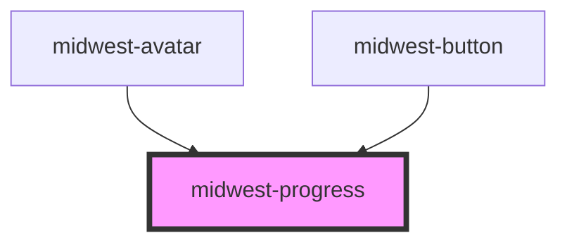

# midwest-progress

<!-- Auto Generated Below -->

## Usage

### Default

<midwest-progress value="1" max="20" id="awesome" slender></midwest-progress>
<midwest-button onClick="document.querySelector('#awesome').value = 3">3</midwest-button>
<midwest-button onClick="document.querySelector('#awesome').value = 9">9</midwest-button>
<midwest-button onClick="document.querySelector('#awesome').value = 18">18</midwest-button>
<midwest-button onClick="document.querySelector('#awesome').slender = !document.querySelector('#awesome').slender">Toggle slender</midwest-button>

## Properties

| Property        | Attribute       | Description | Type      | Default |
| --------------- | --------------- | ----------- | --------- | ------- |
| `dark`          | `dark`          |             | `boolean` | `false` |
| `ease`          | `ease`          |             | `boolean` | `true`  |
| `editable`      | `editable`      |             | `boolean` | `false` |
| `indeterminate` | `indeterminate` |             | `boolean` | `false` |
| `max`           | `max`           |             | `number`  | `100`   |
| `rounded`       | `rounded`       |             | `boolean` | `false` |
| `secondary`     | `secondary`     |             | `number`  | `0`     |
| `slender`       | `slender`       |             | `boolean` | `false` |
| `value`         | `value`         |             | `number`  | `0`     |

## Events

| Event    | Description | Type               |
| -------- | ----------- | ------------------ |
| `update` |             | `CustomEvent<any>` |

## Dependencies

### Used by

 - [midwest-avatar](../avatar)
 - [midwest-button](../button)

### Graph

----------------------------------------------

*Built with [StencilJS](https://stenciljs.com/)*
