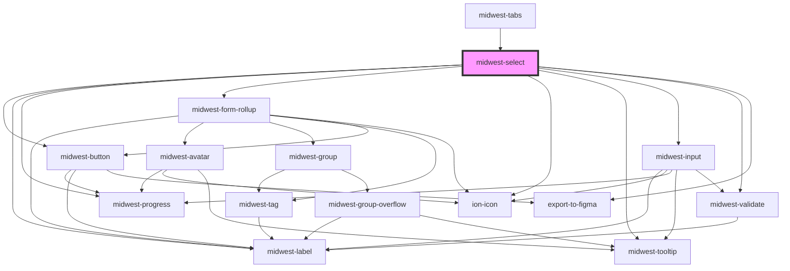

# midwest-select

<!-- Auto Generated Below -->

## Properties

| Property      | Attribute      | Description | Type                                | Default                 |
| ------------- | -------------- | ----------- | ----------------------------------- | ----------------------- |
| `align`       | `align`        |             | `"left" \| "right"`                 | `"left"`                |
| `changeTheme` | `change-theme` |             | `"base" \| "complement" \| boolean` | `undefined`             |
| `dark`        | `dark`         |             | `boolean`                           | `false`                 |
| `description` | `description`  |             | `string`                            | `undefined`             |
| `export`      | `export`       |             | `boolean`                           | `undefined`             |
| `focused`     | `focused`      |             | `boolean`                           | `undefined`             |
| `inline`      | `inline`       |             | `boolean`                           | `undefined`             |
| `invert`      | `invert`       |             | `boolean`                           | `undefined`             |
| `label`       | `label`        |             | `string`                            | `undefined`             |
| `loading`     | `loading`      |             | `boolean`                           | `undefined`             |
| `multiple`    | `multiple`     |             | `boolean`                           | `undefined`             |
| `name`        | `name`         |             | `string`                            | `"select"`              |
| `noAvatars`   | `no-avatars`   |             | `boolean`                           | `undefined`             |
| `noClear`     | `no-clear`     |             | `boolean`                           | `undefined`             |
| `novalidate`  | `novalidate`   |             | `boolean`                           | `undefined`             |
| `open`        | `open`         |             | `boolean`                           | `false`                 |
| `pjaxReplace` | `pjax-replace` |             | `string`                            | `undefined`             |
| `placeholder` | `placeholder`  |             | `string`                            | `"Choose something..."` |
| `position`    | `position`     |             | `"down" \| "up"`                    | `undefined`             |
| `ready`       | `ready`        |             | `boolean`                           | `false`                 |
| `required`    | `required`     |             | `boolean`                           | `false`                 |
| `resize`      | `resize`       |             | `"full" \| boolean`                 | `false`                 |
| `search`      | `search`       |             | `boolean`                           | `false`                 |
| `size`        | `size`         |             | `"large" \| "small" \| "tiny"`      | `undefined`             |
| `tooltip`     | `tooltip`      |             | `string`                            | `undefined`             |
| `valid`       | `valid`        |             | `boolean`                           | `undefined`             |
| `value`       | `value`        |             | `string \| string[]`                | `undefined`             |
| `verbiage`    | `verbiage`     |             | `string`                            | `"item"`                |
| `verbiageAn`  | `verbiage-an`  |             | `boolean`                           | `undefined`             |
| `wide`        | `wide`         |             | `boolean`                           | `undefined`             |

## Events

| Event    | Description | Type               |
| -------- | ----------- | ------------------ |
| `update` |             | `CustomEvent<any>` |

## Methods

### `close() => Promise<void>`

#### Returns

Type: `Promise<void>`

### `optionEls() => Promise<HTMLMidwestItemElement[]>`

#### Returns

Type: `Promise<HTMLMidwestItemElement[]>`

### `options() => Promise<string[]>`

#### Returns

Type: `Promise<string[]>`

### `validate(set?: boolean) => Promise<FormResult>`

#### Returns

Type: `Promise<FormResult>`

## Dependencies

### Used by

 - midwest-tabs

### Depends on

- midwest-button
- midwest-label
- midwest-progress
- [midwest-form-rollup](../form-rollup)
- ion-icon
- midwest-tooltip
- [midwest-input](../input)
- [midwest-validate](../validate)
- export-to-figma

### Graph

----------------------------------------------

*Built with [StencilJS](https://stenciljs.com/)*
