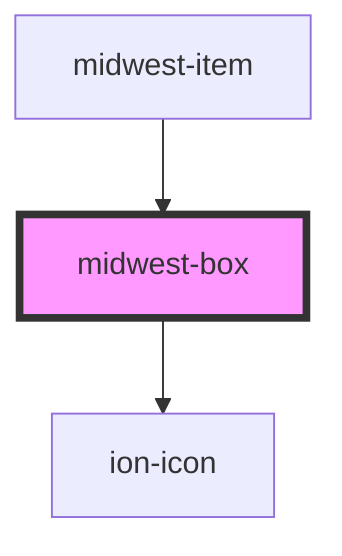

# midwest-box

<!-- Auto Generated Below -->

## Properties

| Property   | Attribute  | Description | Type      | Default |
| ---------- | ---------- | ----------- | --------- | ------- |
| `checked`  | `checked`  |             | `boolean` | `false` |
| `dark`     | `dark`     |             | `boolean` | `false` |
| `disabled` | `disabled` |             | `boolean` | `false` |
| `focused`  | `focused`  |             | `boolean` | `false` |
| `radio`    | `radio`    |             | `boolean` | `false` |

## Dependencies

### Used by

 - [midwest-item](../item)

### Depends on

- ion-icon

### Graph

----------------------------------------------

*Built with [StencilJS](https://stenciljs.com/)*
