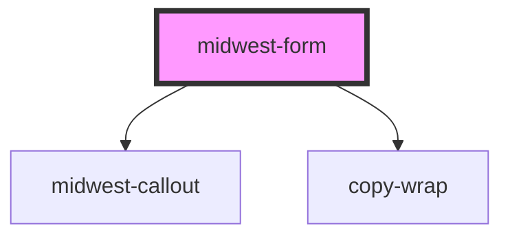

# midwest-form

<!-- Auto Generated Below -->

## Properties

| Property              | Attribute                | Description | Type      | Default                 |
| --------------------- | ------------------------ | ----------- | --------- | ----------------------- |
| `acceptCharset`       | `accept-charset`         |             | `string`  | `undefined`             |
| `action`              | `action`                 |             | `string`  | `undefined`             |
| `ajax`                | `ajax`                   |             | `boolean` | `false`                 |
| `autocomplete`        | `autocomplete`           |             | `string`  | `'on'`                  |
| `autosave`            | `autosave`               |             | `boolean` | `false`                 |
| `closeModalOnSuccess` | `close-modal-on-success` |             | `boolean` | `undefined`             |
| `enctype`             | `enctype`                |             | `string`  | `'multipart/form-data'` |
| `method`              | `method`                 |             | `string`  | `'get'`                 |
| `name`                | `name`                   |             | `string`  | `undefined`             |
| `perform`             | `perform`                |             | `boolean` | `false`                 |
| `target`              | `target`                 |             | `string`  | `undefined`             |
| `validate`            | `validate`               |             | `boolean` | `true`                  |

## Events

| Event         | Description | Type               |
| ------------- | ----------- | ------------------ |
| `fastUpdates` |             | `CustomEvent<any>` |
| `modalClose`  |             | `CustomEvent<any>` |
| `modalOpen`   |             | `CustomEvent<any>` |
| `submitted`   |             | `CustomEvent<any>` |
| `updated`     |             | `CustomEvent<any>` |

## Methods

### `addElement(el: HTMLElement) => Promise<void>`

#### Returns

Type: `Promise<void>`

### `addFieldGroup(el: any) => Promise<void>`

#### Returns

Type: `Promise<void>`

### `get(name?: string, validate?: boolean) => Promise<{ els: any; json: any; results: FormResult[]; namedResults: { [name: string]: string; }; formData: any; valid: boolean; }>`

#### Returns

Type: `Promise<{ els: any; json: any; results: FormResult[]; namedResults: { [name: string]: string; }; formData: any; valid: boolean; }>`

### `removeElement(el: HTMLElement) => Promise<void>`

#### Returns

Type: `Promise<void>`

### `removeFieldGroup(el: any) => Promise<void>`

#### Returns

Type: `Promise<void>`

### `state(validate?: boolean) => Promise<{ els: any; json: any; results: FormResult[]; namedResults: { [name: string]: string; }; formData: any; valid: boolean; }>`

#### Returns

Type: `Promise<{ els: any; json: any; results: FormResult[]; namedResults: { [name: string]: string; }; formData: any; valid: boolean; }>`

### `submitForm(button?: any) => Promise<void>`

#### Returns

Type: `Promise<void>`

## Dependencies

### Depends on

- midwest-callout
- copy-wrap

### Graph

----------------------------------------------

*Built with [StencilJS](https://stenciljs.com/)*
