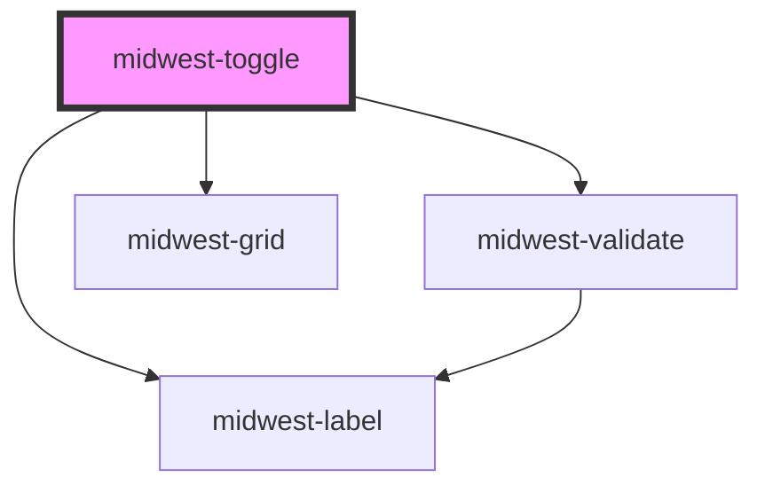

# midwest-toggle

<!-- Auto Generated Below -->

## Properties

| Property      | Attribute      | Description                                    | Type                                                                                                                                                  | Default      |
| ------------- | -------------- | ---------------------------------------------- | ----------------------------------------------------------------------------------------------------------------------------------------------------- | ------------ |
| `base`        | `base`         |                                                | `"blue" \| "cyan" \| "gold" \| "gray" \| "green" \| "indigo" \| "lime" \| "magenta" \| "orange" \| "pink" \| "red" \| "teal" \| "violet" \| "yellow"` | `undefined`  |
| `block`       | `block`        |                                                | `boolean`                                                                                                                                             | `false`      |
| `complement`  | `complement`   |                                                | `"blue" \| "cyan" \| "gold" \| "gray" \| "green" \| "indigo" \| "lime" \| "magenta" \| "orange" \| "pink" \| "red" \| "teal" \| "violet" \| "yellow"` | `undefined`  |
| `dark`        | `dark`         | Sets the button or link as an outlined button. | `boolean`                                                                                                                                             | `false`      |
| `description` | `description`  |                                                | `string`                                                                                                                                              | `undefined`  |
| `export`      | `export`       | Makes sure this element cannot be exported.    | `boolean`                                                                                                                                             | `undefined`  |
| `flip`        | `flip`         |                                                | `boolean`                                                                                                                                             | `false`      |
| `inlineLabel` | `inline-label` |                                                | `boolean`                                                                                                                                             | `undefined`  |
| `label`       | `label`        |                                                | `string`                                                                                                                                              | `undefined`  |
| `name`        | `name`         |                                                | `string`                                                                                                                                              | `""`         |
| `novalidate`  | `novalidate`   |                                                | `boolean`                                                                                                                                             | `undefined`  |
| `required`    | `required`     |                                                | `boolean`                                                                                                                                             | `undefined`  |
| `single`      | `single`       |                                                | `boolean`                                                                                                                                             | `undefined`  |
| `size`        | `size`         |                                                | `string`                                                                                                                                              | `undefined`  |
| `stacked`     | `stacked`      |                                                | `boolean`                                                                                                                                             | `false`      |
| `type`        | `type`         |                                                | `"checkbox" \| "radio"`                                                                                                                               | `"checkbox"` |
| `value`       | `value`        |                                                | `string \| string[]`                                                                                                                                  | `undefined`  |

## Events

| Event    | Description | Type               |
| -------- | ----------- | ------------------ |
| `update` |             | `CustomEvent<any>` |

## Methods

### `optionEls() => Promise<HTMLMidwestItemElement[]>`

#### Returns

Type: `Promise<HTMLMidwestItemElement[]>`

### `validate(set?: boolean) => Promise<FormResult>`

#### Returns

Type: `Promise<FormResult>`

## Dependencies

### Depends on

- [midwest-validate](../validate)
- midwest-grid
- midwest-label

### Graph

----------------------------------------------

*Built with [StencilJS](https://stenciljs.com/)*
