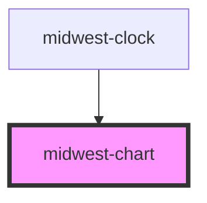

# midwest-chart

<!-- Auto Generated Below -->

## Properties

| Property        | Attribute        | Description | Type                                                                                                                              | Default               |
| --------------- | ---------------- | ----------- | --------------------------------------------------------------------------------------------------------------------------------- | --------------------- |
| `chartTitle`    | `chart-title`    |             | `string`                                                                                                                          | `undefined`           |
| `config`        | --               |             | `HighchartsModel`                                                                                                                 | `new HighchartsModel` |
| `dark`          | `dark`           |             | `boolean`                                                                                                                         | `false`               |
| `data`          | `data`           |             | `string`                                                                                                                          | `undefined`           |
| `enableCredits` | `enable-credits` |             | `boolean`                                                                                                                         | `false`               |
| `exporting`     | `exporting`      |             | `boolean`                                                                                                                         | `false`               |
| `for`           | `for`            |             | `string`                                                                                                                          | `undefined`           |
| `src`           | `src`            |             | `string`                                                                                                                          | `undefined`           |
| `type`          | `type`           |             | `"area" \| "areaspline" \| "bar" \| "bubble" \| "column" \| "line" \| "pie" \| "polygon" \| "scatter" \| "spline" \| "waterfall"` | `undefined`           |

## Methods

### `get_options() => Promise<any>`

#### Returns

Type: `Promise<any>`

### `options(newOptions: any) => Promise<void>`

#### Returns

Type: `Promise<void>`

### `refresh() => Promise<void>`

#### Returns

Type: `Promise<void>`

## Dependencies

### Used by

 - [midwest-clock](../clock)

### Graph

----------------------------------------------

*Built with [StencilJS](https://stenciljs.com/)*
