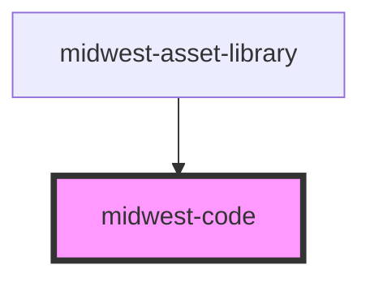

# midwest-code

<!-- Auto Generated Below -->

## Properties

| Property     | Attribute     | Description | Type      | Default     |
| ------------ | ------------- | ----------- | --------- | ----------- |
| `codeString` | `code-string` |             | `string`  | `undefined` |
| `copy`       | `copy`        |             | `boolean` | `true`      |
| `dark`       | `dark`        |             | `boolean` | `false`     |
| `expandable` | `expandable`  |             | `boolean` | `false`     |
| `expanded`   | `expanded`    |             | `boolean` | `false`     |
| `feature`    | `feature`     |             | `boolean` | `false`     |
| `language`   | `language`    |             | `string`  | `"html"`    |
| `preview`    | `preview`     |             | `boolean` | `true`      |
| `simple`     | `simple`      |             | `boolean` | `false`     |

## Methods

### `clipboard() => Promise<void>`

#### Returns

Type: `Promise<void>`

### `highlight() => Promise<void>`

#### Returns

Type: `Promise<void>`

### `result() => Promise<string>`

#### Returns

Type: `Promise<string>`

### `setCode(code: any) => Promise<void>`

#### Returns

Type: `Promise<void>`

## Dependencies

### Used by

 - [midwest-asset-library](../asset-library)

### Graph

----------------------------------------------

*Built with [StencilJS](https://stenciljs.com/)*
