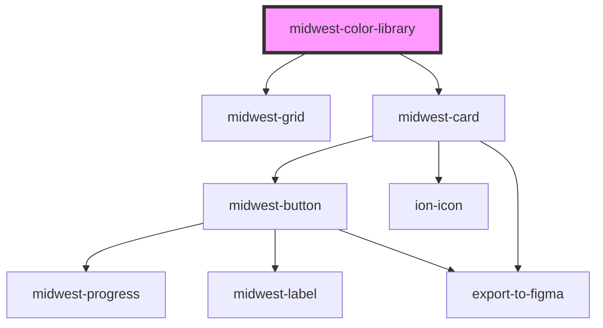

# midwest-color-library

<!-- Auto Generated Below -->

## Usage

### Default

<midwest-color-library></midwest-color-library>

## Properties

| Property | Attribute | Description | Type     | Default     |
| -------- | --------- | ----------- | -------- | ----------- |
| `colors` | `colors`  |             | `string` | `undefined` |
| `shape`  | `shape`   |             | `string` | `undefined` |

## Dependencies

### Depends on

- midwest-grid
- midwest-card

### Graph

----------------------------------------------

*Built with [StencilJS](https://stenciljs.com/)*
