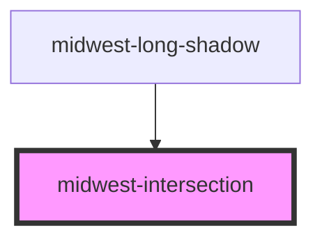

# midwest-intersection

<!-- Auto Generated Below -->

## Properties

| Property   | Attribute  | Description | Type                    | Default     |
| ---------- | ---------- | ----------- | ----------------------- | ----------- |
| `element`  | `element`  |             | `HTMLElement \| string` | `undefined` |
| `in`       | --         |             | `Function`              | `() => { }` |
| `margin`   | `margin`   |             | `string`                | `"0%"`      |
| `multiple` | `multiple` |             | `boolean`               | `undefined` |
| `out`      | --         |             | `Function`              | `() => { }` |

## Dependencies

### Used by

 - [midwest-long-shadow](../long-shadow)

### Graph

----------------------------------------------

*Built with [StencilJS](https://stenciljs.com/)*
